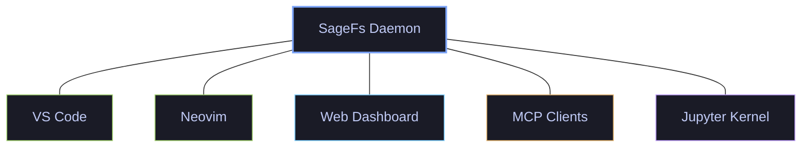
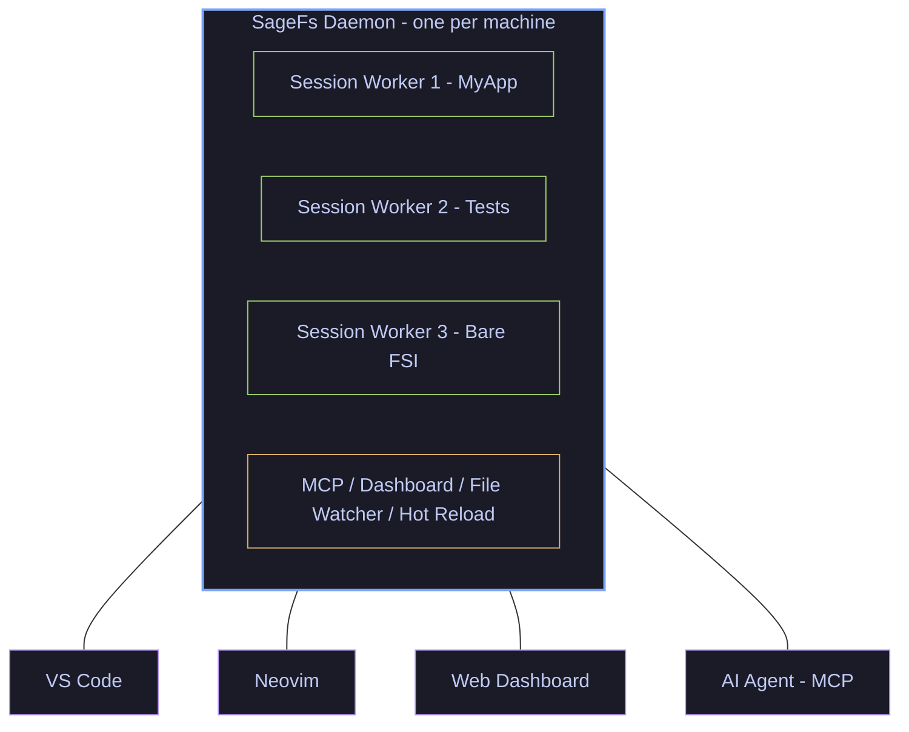

This is an experiment in testing the limits of agentic development, and so many of it's features are still in progress and not as well understood as I'd like.
Feel free to submit issues, or pull requests, if you like. 
If you really need to get ahold of me, the most reliable way is on discord, so you can hit me up there, if you like, my name is the same on there, too.

<div align="center">

# SageFs

### You save. Tests pass. Browser updates. Under a second.

A live F# engine with hot reload, live testing, and AI-agent support — for any editor, free.

[](https://www.nuget.org/packages/SageFs/)
[](https://dotnet.microsoft.com)
[](LICENSE)
[]()
[]()

</div>

## What is SageFs?

SageFs is a live F# development engine. Start it once, then connect from VS Code, Neovim, the web dashboard, or an MCP client, and you get feedback on every save in under 500ms: inline results, live test markers, hot reload, and agent access. It runs as a daemon with isolated session workers, so editors, dashboard tabs, and MCP clients can all share live state at the same time.

**How is SageFs different from Ionide?** Ionide provides IntelliSense, diagnostics, and project support through the F# Compiler Service. SageFs adds live execution: eval any expression and see results inline, continuous test feedback on every save, and hot reload that patches your running app. Use both together — Ionide for editing, SageFs for running.

**Platforms:** Windows, macOS, Linux. Requires .NET 10 SDK.

**Status:** Active development. Used in production by the author.

## Table of Contents

- [Key Features](#key-features)
- [Get Started](#get-started)
- [Two Workflows: REPL vs Live](#two-workflows-repl-vs-live)
- [How SageFs Works](#how-sagefs-works)
- [What You Get in Each Editor](#what-you-get-in-each-editor)
- [Keybindings](#%EF%B8%8F-keybindings-across-editors)
- [Gutter Icons](#-gutter-icons)
- [Live Testing Cost Comparison](#live-testing-cost-comparison)
- [Under the Hood](#under-the-hood)
- [Repository Map](#repository-map--where-things-live)
- [Coming from Another Language?](#coming-from-another-language)
- [Visual Demos](#-visual-demos)
- [Contributing](#contributing)
- [License](#license)

>### 🆕 Never written F#? You're in the right place.
>
> Pick your language — each guide maps familiar concepts to F#, with runnable examples that show results as soon as you press Alt+Enter.
>
> 🐍 [Python](docs/coming-from-python.md) · 📓 [Jupyter](docs/coming-from-jupyter.md) · 🔷 [C#](docs/coming-from-csharp.md) · ☕ [Java](docs/coming-from-java.md) · 🟨 [JS/TS](docs/coming-from-javascript.md) · 🦀 [Rust](docs/coming-from-rust.md) · 🧘 [F# Koans](docs/coming-from-koans.md)
>
> Or just dive in: `dotnet tool install --global SageFs && sagefs` — then open any `.fsx` file and hit Alt+Enter.

---

## Key Features

### ⚡ Hot Reload

> **🚧 Status: In progress** — the reload pipeline (watch → eval → SSE refresh) is live, but propagating changes into a *running* app is still being completed for module-declared apps. See [docs/hot-reload.md](docs/hot-reload.md) for the current status.

Save a `.fs` file and SageFs reloads it in about 100ms using [Harmony](https://github.com/pardeike/Harmony) runtime patching — no rebuild, no restart. Connected browsers refresh automatically over SSE.

### 🤖 AI Agent Support

SageFs exposes a [Model Context Protocol](https://modelcontextprotocol.io/) server with an affordance-driven state machine and a deliberately small tool surface: AI agents only see the tools valid for the current session state, so they don't waste tokens guessing. The core MCP path focuses on session trust, F# evaluation, exact test execution, and failure explanation. Copilot, Claude, and any MCP client can execute F# code, type-check it, verify a changed behavior, and run tests against your real project.

### 🖥️ One Daemon, Every Client

Start SageFs once, then connect from VS Code, Neovim, the web dashboard, or an MCP client. Open several at the same time — they can share a live session, and each client keeps its own session selection.


```mermaid
flowchart TB
    D[SageFs Daemon]

    D --- VS[VS Code]
    D --- NV[Neovim]
    D --- WB[Web Dashboard]
    D --- AI[MCP Clients]
    D --- JP[Jupyter Kernel]

    style D fill:#1a1b26,stroke:#7aa2f7,stroke-width:2px,color:#c0caf5
    style VS fill:#1a1b26,stroke:#9ece6a,color:#c0caf5
    style NV fill:#1a1b26,stroke:#9ece6a,color:#c0caf5
    style WB fill:#1a1b26,stroke:#7dcfff,color:#c0caf5
    style AI fill:#1a1b26,stroke:#e0af68,color:#c0caf5
    style JP fill:#1a1b26,stroke:#bb9af7,color:#c0caf5
```

---

## Get Started

### 1. Install SageFs (30 seconds)

**Prerequisites:** [.NET 10 SDK](https://dotnet.microsoft.com/download/dotnet/10.0). That's it.

```bash
dotnet tool install --global SageFs
```

### 2. Check your environment (optional)

```bash
sagefs check
```

Validates .NET SDK, FSI, project files, port availability, and daemon state. Actionable hints on every failure. Skip this if you've used SageFs before.

### 3. Start the daemon

```bash
sagefs
```

SageFs opens an interactive terminal. Then create a session for `YourProject.fsproj` from your editor, MCP client, or the dashboard.

> No project? Just run `sagefs` with no arguments — the daemon starts bare and waits for clients. Your editor will create sessions on demand.

### 4. Connect your editor

**VS Code** — Install **SageFs** from the [Marketplace](https://marketplace.visualstudio.com/items?itemName=willehrendreich.sagefs) or [Open VSX](https://open-vsx.org/extension/willehrendreich/sagefs) (or the `.vsix` from [Releases](https://github.com/WillEhrendreich/SageFs/releases)), open an F# file, and press `Alt+Enter` on any expression. The result appears inline in under 500ms.

**Neovim** — Add `"WillEhrendreich/sagefs.nvim"` to your plugin manager. Press `Alt+Enter` to evaluate. See [Neovim setup](https://github.com/WillEhrendreich/sagefs.nvim).

**Web dashboard** — Open `http://localhost:37750/dashboard` for session management, evaluation, output, test state, and diagnostics without an editor extension.

> **Deprecated frontends:** The built-in SageTUI client, legacy TUI, `SageFs.Gui` Raylib frontend, and the Visual Studio extension are no longer current product interfaces. Their source remains in the repository for historical context. This does not affect Raylib application and game projects developed with SageFs; see the [Raylib demos](#-visual-demos).

### 5. Enable live testing

> **The core loop works today** — save-to-green live testing runs end-to-end: SageFs discovers your tests, runs the affected ones, and streams pass/fail inline with source-mapped gutter markers and coverage (verified end-to-end on Expecto). Breadth is still hardening — other frameworks, session switching, and test-discovery timing can still have rough edges.

When live testing is enabled and a test session is loaded, save-triggered runs can update gutter state automatically.
The core engine, SSE events, coverage data, and editor integrations already work today, but client polish and discovery/session behavior are still catching up. Expecto is the best-covered path right now.

### 6. What you'll see

- **Gutter markers**: ✓ green (passing), ✗ red (failing), ○ gray (no coverage)
- **Inline results**: Expression values appear to the right of your code
- **Coverage bars**: Colored bars in the gutter show which lines are covered by tests
- **Failure details**: Hover over red markers to see Expected vs Actual diffs

> 💡 **Tip**: Use the **SageFs: Mark All Tests Stale** command (Command Palette) to re-run everything.

```
MCP (streamable HTTP):  http://localhost:37749/       ← recommended for new MCP clients
MCP (legacy SSE):       http://localhost:37749/sse    ← older MCP clients
Dashboard:              http://localhost:37750/dashboard
```

> **New to F#?** You don't need any F# knowledge to start. Jump to the [migration guide for your language](#coming-from-another-language) — each one maps concepts you already know to F#, with runnable examples.

<details>
<summary>Build from source</summary>

```bash
git clone https://github.com/WillEhrendreich/SageFs.git
cd SageFs
dotnet build && dotnet pack SageFs -o nupkg
dotnet tool install --global SageFs --add-source ./nupkg --no-cache
```

</details>

📚 **[Full Documentation](docs/README.md)** — Guides, deep dives, technical reference, and contributor docs.

---

## Two Workflows: REPL vs Live

> 📖 **[Full guide: Understanding Workflow Modes](docs/workflow-modes.md)** — decision tree, diagrams, real-world scenarios, troubleshooting, and why live testing isn't a third mode.

SageFs sessions run in one of two modes. The tradeoff between them comes from a physical constraint of the .NET runtime, not from a SageFs limitation.

**REPL mode** (default) gives you a full interactive F# session. You can redefine types, experiment freely, and iterate on designs. This is what you want when you're prototyping domain types, exploring APIs, or working through a problem interactively.

**Live mode** enables browser hot reload — save a `.fs` file and connected browsers update instantly via SSE, with no manual refresh. To make this work, SageFs uses runtime patching to inject code changes into the running app. That patching requires a single-assembly FSI mode, which means you **cannot redefine types** (you'll get FS0037 errors). Expressions, function bodies, and let bindings work fine.

> **🚧 Hot reload is in progress** — the pipeline runs, but changes may not yet propagate into a running module-declared app. See [docs/hot-reload.md](docs/hot-reload.md).

| | REPL (default) | Live |
|:---|:---|:---|
| **Type redefinition** | ✅ Full — redefine types freely | ❌ FS0037 — expression-level changes only |
| **Browser hot reload** | ❌ Manual refresh required | 🚧 In progress — pipeline live, app propagation being completed |
| **Live testing** | ⚠️ Available in both — still stabilizing | ⚠️ Available in both — still stabilizing |
| **Best for** | Prototyping, domain modeling, exploration | Web apps with Falco, Datastar, ASP.NET |

### Choosing the right mode

- **Building a web app** with Falco.Datastar, Giraffe, or any ASP.NET pipeline? Use **Live** — you want save-and-see-it feedback in the browser.
- **Exploring types**, designing domain models, writing tests, or working in `.fsx` scripts? Use **REPL** — you need the freedom to reshape types as you go.
- **Not sure?** Start with REPL. Switch to Live when you need browser hot reload.

### Switching modes

Use your editor's command to switch workflows:

- **Neovim**: `:SageFsWorkflow live` or `:SageFsWorkflow repl`
- **VS Code**: Command Palette → `SageFs: Switch Workflow`
- **MCP**: use the session workflow tools exposed for the current state

When you switch, SageFs creates a new session in the target mode and stops the old one. Any REPL-defined bindings are lost — persisted files are unaffected.

### Auto-detection

When SageFs detects web-oriented packages in your project (Falco.Datastar, Giraffe, Saturn, etc.), it suggests switching to Live mode. You can accept or dismiss the suggestion.

---

## How SageFs Works

SageFs has exactly **three concepts**: a daemon, sessions, and clients.


```mermaid
flowchart TB
    subgraph D[SageFs Daemon - one per machine]
        S1[Session Worker 1 - MyApp]
        S2[Session Worker 2 - Tests]
        S3[Session Worker 3 - Bare FSI]
        SVC[MCP / Dashboard / File Watcher / Hot Reload]
    end

    D --- VS[VS Code]
    D --- NV[Neovim]
    D --- WB[Web Dashboard]
    D --- AI[AI Agent - MCP]

    style D fill:#1a1b26,stroke:#7aa2f7,stroke-width:2px,color:#c0caf5
    style S1 fill:#1a1b26,stroke:#9ece6a,color:#c0caf5
    style S2 fill:#1a1b26,stroke:#9ece6a,color:#c0caf5
    style S3 fill:#1a1b26,stroke:#9ece6a,color:#c0caf5
    style SVC fill:#1a1b26,stroke:#e0af68,color:#c0caf5
    style VS fill:#1a1b26,stroke:#bb9af7,color:#c0caf5
    style NV fill:#1a1b26,stroke:#bb9af7,color:#c0caf5
    style WB fill:#1a1b26,stroke:#bb9af7,color:#c0caf5
    style AI fill:#1a1b26,stroke:#bb9af7,color:#c0caf5
```

**The daemon is a service.** It starts with no project and no session — it just listens, and clients tell it what to do.

**Sessions are isolated workers.** Each session is a separate OS process with its own FSI instance, project, and file watcher, so they can't interfere with each other. Create as many as you need.

**Clients are thin.** Editor integrations, dashboard tabs, the Jupyter bridge, and MCP clients all connect to the same daemon. They create sessions, send code, and read results. Multiple clients can share the same session or each use their own.

**The workflow:**

1. Start the daemon: `sagefs`
2. A client (editor, Jupyter, dashboard, AI) creates a session: `POST /api/sessions/create` with a project path
3. The daemon spawns a worker, loads the project, starts watching files
4. The client sends code, reads diagnostics, runs tests — all through the daemon
5. Other clients can connect to the same session simultaneously

This means **the daemon doesn't need to know your project at startup**. It starts bare and waits for clients to create or attach to sessions.

---

## What You Get in Each Editor

Every frontend connects to the same daemon. Open several at once — they all see the same state.

| Capability | VS Code | Neovim | Web Dashboard | MCP |
|:---|:---:|:---:|:---:|:---:|
| Eval code / file / block | ✅ | ✅ | ✅ | ✅ |
| Inline results | ✅ | ✅ | ✅ | ✅ |
| Live diagnostics (SSE) | ✅ | ✅ | ✅ | ✅ |
| Hot reload controls | ✅ | ✅ | ✅ | ✅ |
| Session management | ✅ | ✅ | ✅ | ✅ |
| Code completion | ✅ | ✅ | — | ✅ |
| CodeLens | ✅ | ✅ | — | — |
| **Live test gutters** | ✅ | ✅ | — | — |
| **Coverage gutters** | ✅ | ✅ | — | — |
| **Failure narratives** | ✅ | ✅ | ✅ | ✅ |
| **Test source-jump** | ✅ | ✅ | — | — |
| Test panel | ✅ | ✅ | ✅ | ✅ |
| Test policy controls | ✅ | ✅ | ✅ | ✅ |
| Type explorer | ✅ | ✅ | — | ✅ |
| Call graph | ✅ | ✅ | — | ✅ |
| History browser | ✅ | ✅ | ✅ | ✅ |
| Test trace | ✅ | ✅ | ✅ | ✅ |

> ¹ Server-side data ready. Editor UI integration pending (VS SDK limitations or work-in-progress).

<details>
<summary><strong>Editor setup guides</strong></summary>

#### VS Code

Install **SageFs** from the [VS Code Marketplace](https://marketplace.visualstudio.com/items?itemName=willehrendreich.sagefs) or [Open VSX](https://open-vsx.org/extension/willehrendreich/sagefs), or the `.vsix` in [Releases](https://github.com/WillEhrendreich/SageFs/releases). Written in F# via [Fable](https://fable.io/), not TypeScript.

Current wiring includes Alt+Enter eval, CodeLens, live test decorations, native Test Explorer integration, hot reload sidebar, session context, type explorer, call graph, event history, dashboard webview, status bar, auto-start, Ionide command hijacking, coverage gutter bars, inline failure decorations, failure narrative enrichment, and test source-jump.

#### Neovim

[**sagefs.nvim**](https://github.com/WillEhrendreich/sagefs.nvim) — 62 Lua modules, 55 commands, 1400+ tests.

```lua
-- lazy.nvim
{ "WillEhrendreich/sagefs.nvim", ft = { "fsharp" }, opts = { port = 37749, auto_connect = true } }
```

Features: Cell eval, inline results, gutter signs, SSE live updates, live test panel, coverage panel with per-file breakdown, type explorer, call graph, history browser, session export to `.fsx`, code completion, branch coverage gutters, filterable test panel, display density presets, combined statusline component, Telescope source-jump (`<CR>`), failure narrative floating window (`<C-d>`), and SSE-driven test state caching.

#### AI Agent (MCP)

SageFs exposes about 50 MCP tools — from `send_fsharp_code` to `targeted_verify` to `list_tests` — gated by session state, so an agent only sees the ones valid right now. Any MCP client can connect. See the [full MCP Tools Reference](docs/mcp-tools.md) for the complete list and per-client configuration examples.

**Streamable HTTP** (recommended — auto-reconnects, no session drops):
```json
{ "mcpServers": { "sagefs": { "type": "streamable-http", "url": "http://localhost:37749/" } } }
```

**SSE** (legacy clients that don't support Streamable HTTP yet):
```json
{ "mcpServers": { "sagefs": { "type": "sse", "url": "http://localhost:37749/sse" } } }
```

**OpenCode** — Add to `~/.opencode.json`:
```json
{
  "mcp": {
    "sagefs": {
      "type": "remote",
      "url": "http://localhost:37749/sse",
      "enabled": true
    }
  }
}
```

#### Web Dashboard / Jupyter

```bash
sagefs --jupyter conn.json  # Run as a Jupyter kernel
# Dashboard auto-starts at http://localhost:37750/dashboard
```

</details>

---

## ⌨️ Keybindings Across Editors

| Action | VS Code | Neovim |
|--------|---------|--------|
| Evaluate selection/cell | `Alt+Enter` | `<M-CR>` |
| Evaluate entire file | `Alt+Shift+Enter` | `<leader>rf` |
| Clear inline results | Command Palette | `<leader>rc` |
| Run all tests | Command Palette | `<leader>rT` |
| Toggle test panel | Command Palette | `:SageFsTestPanel` |
| Jump to test source | Click test in explorer | `<CR>` in telescope |
| Show failure narrative | Hover on red marker | `<C-d>` in test panel |
| Mark all stale | Command Palette | `<leader>rS` |
| Session picker | Command Palette | `<leader>rs` |

> **Full keybinding references**: [VS Code](sagefs-vscode/README.md) · [Neovim](https://github.com/WillEhrendreich/sagefs.nvim#keymaps)

---

## 🎨 Gutter Icons

| Icon | Meaning |
|------|---------|
| ✓ (green) | Test passing — this code is covered by at least one passing test |
| ✗ (red) | Test failing — a test covering this code has failed |
| ○ (gray) | No coverage — no test exercises this line |
| │ (green bar) | Coverage healthy — all tests covering this line pass |
| │ (red bar) | Coverage degraded — some tests covering this line are failing |
| │ (gray bar) | Not covered — no test reaches this line |
| ⊘ | Inline failure — shows the test name and Expected/Actual diff |

> 💡 **Hover** over any gutter icon for details. In Neovim, press `<C-d>` on a failing test for the full failure narrative.

---

## Live Testing Cost Comparison

Visual Studio Enterprise charges about $250/month per seat for Live Unit Testing — $3,000/year per developer. It only works in Visual Studio, it only supports 3 frameworks, it takes 5-30 seconds, and it requires your code to compile first.

SageFs is building toward that same feedback loop with a REPL-centered architecture. The core live-testing engine works, but the end-to-end experience is still being stabilized and isn't equally polished in every client yet.

| | VS Enterprise Live Testing | **SageFs** |
|:---|:---|:---|
| **Speed** | 5–30 sec (MSBuild rebuild) | **300–800ms typical** on the current FSI-driven hot path |
| **Broken code** | ✗ Must compile first | **✓ Tree-sitter works on incomplete code** |
| **Editors** | Visual Studio only | **VS Code · Neovim · Web dashboard · MCP clients** |
| **Frameworks** | MSTest · xUnit · NUnit | **+ Expecto · TUnit · xUnit v3** · extensible |
| **Price** | ~$250/month | **Free, MIT licensed** |

<details>
<summary><strong>Three-speed feedback pipeline — how the sub-second path works</strong></summary>

<br />

1. **~50ms** — Tree-sitter detects test attributes in broken/incomplete code → immediate gutter markers
2. **~350ms** — F# Compiler Service type-checks → dependency graph, reachability annotations
3. **~500ms** — Affected-test execution via hot-eval → ✓/✗ results inline

Tests are automatically categorized (Unit, Integration, Browser, Property, Benchmark, Architecture), each with its own run policy: unit and property tests run automatically by default, integration/browser/architecture run on demand by default, and benchmarks stay disabled until you turn them on. All of this is configurable. SageFs's own suite leans hard on property-based testing — 619 property-based tests exercise the binary format, state machines, and event folds against generated inputs (this count is derived from source, not hand-maintained).

</details>

---

## Under the Hood

**Hot Reload** — File changes are detected, sent to FSI via `#load`, and [Harmony](https://github.com/pardeike/Harmony) patches method pointers at runtime. Connected browsers auto-refresh via SSE. *Status: in progress — see [docs/hot-reload.md](docs/hot-reload.md).* [Full details →](docs/hot-reload.md)

**Multi-Session** — Run multiple isolated F# sessions simultaneously, each in its own worker sub-process with independent FSI, project, and file watcher. [Full details →](docs/multi-session.md)

**MCP Tools** — about 50 tools for session trust, code execution, test listing and verification, failure explanation, analysis, and local friction reporting. They are affordance-gated: agents see only the tools valid for the current session state. [Full reference →](docs/mcp-tools.md)

**SSE Events** — All editors receive `test_source_locations`, `file_annotations`, and `failure_narratives` events tagged with `SessionId`. [Full reference →](docs/sse-events.md)

**Architecture** — Daemon-first design with isolated worker sub-processes, a web dashboard, editor integrations, and an affordance-driven MCP surface. [Full details →](docs/architecture.md)

### Repository Map — where things live

- `SageFs.Core/` — shared engine and runtime logic: session management, MCP/session operations, live testing, persistence, and shared rendering primitives
- `SageFs/` — CLI entrypoint, daemon host, MCP server, dashboard, and worker HTTP transport; deprecated terminal client source is retained for historical context
- `SageFs.Gui/` — deprecated Raylib product frontend retained as legacy source; it is separate from supported Raylib application and game projects
- `SageFs.Tests/` — main Expecto test suite
- `sagefs-vscode/` — VS Code extension (F# via Fable → JavaScript)
- `sagefs-vs/` — deprecated Visual Studio extension, retained as legacy source
- `docs/` — user docs, architecture notes, troubleshooting, and feature references
- `samples/` — runnable sample apps and language-onramp projects
- `tests/` — Playwright/browser scenarios for dashboard and editor-facing UX flows
- `scripts/` — repo helper scripts and smoke/integration utilities

`SageFs.slnx` covers the core tool, retained legacy projects, tests, and samples. The VS Code integration lives alongside it in `sagefs-vscode/` because it uses its own packaging toolchain and release flow.

The Neovim plugin is not in this repo — it lives in the separate [`sagefs.nvim`](https://github.com/WillEhrendreich/sagefs.nvim) repository.

If you're tracing the live testing / "test as you type" stack, start here:

- Engine, discovery, dependency graph, and coverage: `SageFs.Core/Features/LiveTestingExecutors.fs`, `LiveTestingTypes.fs`, `CoverageInstrumenter.fs`, `TestDiscovery.fs`, `TestTreeSitter.fs`
- Daemon routes, watchers, and SSE emission: `SageFs/DaemonMode.fs`, `SageFs/McpServer.fs`, `SageFs/McpTools.fs`
- VS Code client wiring: `sagefs-vscode/src/Extension.fs`, `LiveTestingListener.fs`, `TestControllerAdapter.fs`, `FileAnnotationsListener.fs`
- Neovim client wiring: the separate `sagefs.nvim` repo

<details>
<summary><strong>🛡️ Supervised Mode — restart automatically on crash</strong></summary>

<br />

```bash
sagefs --supervised
```

Erlang-style supervisor with exponential backoff (1s → 2s → 4s → max 30s). After 5 consecutive crashes within 5 minutes, it reports the failure. Watchdog state exposed via `/api/system/status` and shown in the VS Code status bar. Use this when leaving SageFs running all day.

</details>

<details>
<summary><strong>⚡ Standby Pool — instant hard resets</strong></summary>

<br />

SageFs maintains a pool of pre-warmed FSI sessions. Hard resets swap the active session for an already-warm one — near-instant recovery instead of a 30-60 second rebuild.

</details>

<details>
<summary><strong>💾 Binary Session Persistence — instant resume</strong></summary>

<br />

SageFs persists session state and test caches to compact binary files (`.sagefs` v3, `.sagetc` v1) for near-instant cold starts. No JSON parsing, no database — raw binary with CRC-32C integrity checking.

- **Session files** (`.sagefs`): Full session state — interactions, diagnostics, outputs, eval timeline
- **Test cache files** (`.sagetc`): Test discovery results, outcomes, durations, bitmaps of affected tests
- **Session isolation**: Each session writes to its own file, verified by property-based tests covering format corruption, round-trips, and write isolation

Design: length-prefixed strings, section headers with byte-count envelopes, version negotiation, and field-level bounds checking prevent OOM from crafted inputs.

</details>

<details>
<summary><strong>📋 CLI Reference</strong></summary>

<br />

```
Usage: sagefs [options]                Start daemon (bare by default)
       sagefs --supervised [options]   Start with watchdog auto-restart
       sagefs --jupyter <conn.json>    Run as Jupyter kernel
       sagefs check                    Check environment before first run
       sagefs stop                     Stop running daemon
       sagefs status                   Show daemon info

Daemon options:
  --no-resume            Skip restoring previous sessions on startup
  --no-watch             Disable file watching for all sessions
  --prune                Mark all stale sessions as stopped, then exit
  --supervised           Auto-restart on crash (exponential backoff)
  --mcp-port PORT        Custom MCP port (default: 37749). The dashboard runs on this port + 1.
```

The daemon starts bare and waits for clients to create or connect to sessions.

Full options: `sagefs --help`

</details>

<details>
<summary><strong>🔧 Configuration</strong></summary>

<br />

**Per-directory config** — `.SageFs/config.fsx`:

```fsharp
{ DirectoryConfig.empty with
    Load = Projects ["src/MyApp.fsproj"; "tests/MyApp.Tests.fsproj"]
    AutoOpenNamespaces = false
    InitScript = Some "setup.fsx" }
```

Set `AutoOpenNamespaces = false` to skip warmup auto-opening of namespaces and modules. Because sessions inherit `.SageFs/config.fsx` from the working directory, this opt-out applies across VS Code, Neovim, dashboard, and MCP session creation flows.

Built-in ways to create or edit that config:

- **Dashboard** — enter a working directory, then click **Disable Warmup Auto-Open**
- **MCP** — edit the per-directory config through the shared workspace
- **VS Code** — run **SageFs: Configure Warmup Auto-Open**
- **Neovim** — run `:SageFsConfig`

If `.SageFs/config.fsx` does not exist, these affordances create it with:

```fsharp
{ DirectoryConfig.empty with
  AutoOpenNamespaces = false
}
```

If the config already exists, SageFs opens or points you at the file instead of overwriting your existing settings.

**Startup profile** — `~/.SageFs/init.fsx` auto-loads on every session start.

**Precedence:** Per-directory config > auto-discovery from working directory.

</details>

### ❓ Troubleshooting

**Quick start:** Run your editor's health check first (VS Code: `Ctrl+Shift+P` → "SageFs: Check Health" · Neovim: `:checkhealth sagefs`).

| Problem | Quick Fix |
|:---|:---|
| "SageFs daemon not found" | `dotnet tool install --global SageFs`, then `sagefs status` |
| Port already in use | `sagefs stop` or `--mcp-port 8080` |
| Wrong project selected | "SageFs: Switch Project" in command palette |
| Stale REPL after code changes | Save the file first — source edits auto-reload. Use hard reset only for `.fsproj` / package changes. |

📖 **[Full Troubleshooting Guide →](docs/TROUBLESHOOTING.md)** — covers first-run issues, runtime problems, platform-specific fixes, and diagnostic tools.

📊 **[Feature Matrix →](docs/FEATURE_MATRIX.md)** — compare features across VS Code, Neovim, the web dashboard, and MCP.

---

## Coming from Another Language?

You don't need to know F# already. Find your background below for a guide that maps concepts you know to F#, with runnable examples.

> **Quick orientation:** Every sample in [`/samples`](samples/) is a runnable `.fsx` script.
> Open it in a supported editor with SageFs connected, hit **Alt+Enter** on any expression, and results appear inline instantly.

| Background | One-liner | Guide |
|:---|:---|:---|
| 🐍 **Python** | Same REPL energy, plus a compiler that catches bugs before you run | [Guide →](docs/coming-from-python.md) |
| 📓 **Jupyter** | Everything you love about notebooks, minus kernel crashes and JSON diffs | [Guide →](docs/coming-from-jupyter.md) |
| 🔷 **C#** | Same .NET, same NuGet — stop writing `AbstractRepositoryFactoryImpl` | [Guide →](docs/coming-from-csharp.md) |
| ☕ **Java** | Expressive, type-safe, concise — what Java always wished it could be | [Guide →](docs/coming-from-java.md) |
| 🟨 **JS/TS** | No `undefined`, no `this` bugs, no `node_modules` — just functions | [Guide →](docs/coming-from-javascript.md) |
| 🦀 **Rust** | `Option`, `Result`, pattern matching — without the borrow checker | [Guide →](docs/coming-from-rust.md) |
| 🧘 **F# Koans** | You already know F# — now get instant feedback instead of `dotnet run` | [Guide →](docs/coming-from-koans.md) |

---

### 🎯 Visual Demos

See what SageFs makes possible beyond the REPL:

#### 🌐 Reactive Web App — Falco + Datastar, zero JavaScript

A full CRUD todo app in about 100 lines of F#. Edit a handler and save — the browser updates immediately, with no webpack, no bundler, and no framework setup.

**→ [`samples/demos/webapp-datastar.fsx`](samples/demos/webapp-datastar.fsx)**

#### 🎨 GPU Window — Raylib Hello World with hot reload

A Raylib window that hot-patches on save. Change the color, the text, or the animation, save, and it updates live in the running window — no restart, no flicker.

**→ [`samples/demos/raylib-hello.fsx`](samples/demos/raylib-hello.fsx)**

#### 🕹️ Interactive Game — live-tweakable physics

A playable star-catcher game. Edit `starMaxSpeed`, `playerWidth`, and `starColors` in the source file, save, and the changes apply to the running game without interrupting play.

**→ [`samples/demos/raylib-game.fsx`](samples/demos/raylib-game.fsx)**

---

## Contributing

SageFs is open source, and contributions are welcome — bug fixes, documentation improvements, new tests, or whole features. PRs are encouraged.

**→ [Read the Contributing Guide](CONTRIBUTING.md)** for setup instructions, debugging workflow, coding standards, and how to make your first PR.

New to the codebase? Check the **Good First Contributions** section in the contributing guide for places where help is especially welcome.

## License

[MIT](LICENSE)

## Acknowledgments

SageFs exists because of Jo Van Eyck's [fsi-mcp-server](https://github.com/jovaneyck/fsi-mcp-server), a minimal F# Interactive MCP server that proved the concept of connecting FSI to editors via MCP. That project made everything here possible.

[FsiX](https://github.com/soweli-p/FsiX) · [sagefs.nvim](https://github.com/WillEhrendreich/sagefs.nvim) · [Falco](https://github.com/pimbrouwers/Falco) & [Falco.Datastar](https://github.com/spiraloss/Falco.Datastar) · [Harmony](https://github.com/pardeike/Harmony) · [Ionide.ProjInfo](https://github.com/ionide/proj-info/) · [Raylib-cs](https://github.com/ChrisDill/Raylib-cs) · [Fable](https://fable.io/) · [ModelContextProtocol](https://modelcontextprotocol.io/)
