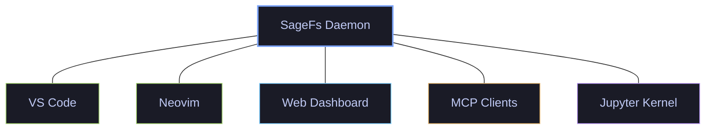
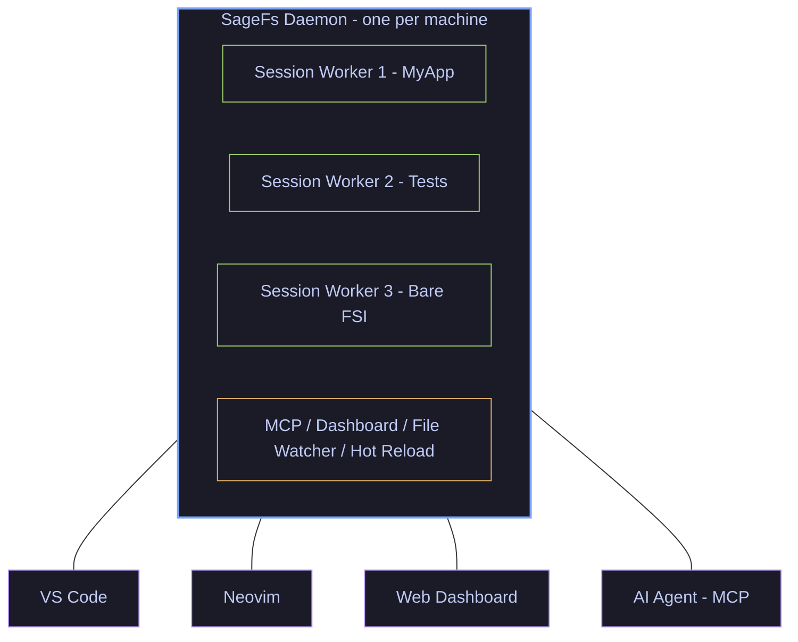

<div align="center">

# SageFs

### You save. The affected tests re-run. The running app serves the new code.

A live F# engine with hot reload, live testing, and AI-agent support, for any editor, free.

[](https://www.nuget.org/packages/SageFs/)
[](https://dotnet.microsoft.com)
[](LICENSE)
[]()
[]()

</div>

## What is SageFs?

Hey, I'm Will. SageFs is the thing I wanted every time I sat there waiting on a rebuild just to find out whether one little function did what I thought it did.

It's a live F# development engine. Start it once, then connect from VS Code, Neovim, the web dashboard, or an MCP client, and you get feedback as you work: inline eval results, live test markers that re-run the affected tests against your edits (saved or not), hot reload, and agent access. It runs as a daemon with isolated session workers, so editors, dashboard tabs, and MCP clients can all share live state at the same time.

**How's it different from Ionide?** Ionide gives you the editor smarts (IntelliSense, diagnostics, project support) through the F# Compiler Service, and it's great. SageFs adds live *execution*: eval any expression and see the result inline, continuous test feedback on every save (or keystroke, if you want it), and hot reload that patches your running app. Use both together: Ionide for editing, SageFs for running. They get along fine.

It runs on Windows, macOS, and Linux. SageFs itself installs with the .NET 10 SDK. Your *projects* aren't stuck on that version though. Each session's host gets built with whichever SDK `dotnet` picks in your project's folder, and runs on that SDK's runtime. So a `global.json` pin is honored, and without one you get the newest SDK you have installed. If you want a project on .NET 10 while an 11 preview is also installed, pin it with `global.json`.

This started as an experiment in how far agentic development could go, and it's grown into the tool I use every day. It's moving fast, it's got rough edges, and you WILL find things you wish worked differently. That's exactly the feedback I want. Feel free to submit issues or PRs, and if you really need to get ahold of me, Discord is the most reliable way, same name there too.

## Table of Contents

- [Key Features](#key-features)
- [Get Started](#get-started)
- [Three Workflows: REPL, Live Testing, and Hot Reload](#three-workflows-repl-live-testing-and-hot-reload)
- [How SageFs Works](#how-sagefs-works)
- [What You Get in Each Editor](#what-you-get-in-each-editor)
- [Keybindings](#%EF%B8%8F-keybindings-across-editors)
- [Gutter Icons](#-gutter-icons)
- [Live Testing Cost Comparison](#live-testing-cost-comparison)
- [Under the Hood](#under-the-hood)
- [Repository Map](#repository-map--where-things-live)
- [Coming from Another Language?](#coming-from-another-language)
- [Visual Demos](#-visual-demos)
- [Contributing](#contributing)
- [License](#license)

>### 🆕 Never written F#? You're in the right place.
>
> Pick your language. Each guide maps familiar concepts to F#, with runnable examples that show results as soon as you press Alt+Enter.
>
> 🐍 [Python](docs/coming-from-python.md) · 📓 [Jupyter](docs/coming-from-jupyter.md) · 🔷 [C#](docs/coming-from-csharp.md) · ☕ [Java](docs/coming-from-java.md) · 🟨 [JS/TS](docs/coming-from-javascript.md) · 🦀 [Rust](docs/coming-from-rust.md) · 🧘 [F# Koans](docs/coming-from-koans.md)
>
> Or just dive in: `dotnet tool install --global SageFs && sagefs`, then open any `.fsx` file and hit Alt+Enter.

---

## Key Features

### ⚡ Hot Reload

Save a `.fs` file and SageFs figures out which functions changed and uses [Harmony](https://github.com/pardeike/Harmony) to re-point those methods in the process that's already running. No rebuild, no restart, and yes, that includes apps whose route table was only ever built once at startup. Connected browsers refresh automatically over SSE.

Because it re-points **methods**, not everything is patchable: a handler that's *called* per request reloads, a handler whose output was *computed once* at startup can't. Prefer `let getHome (ctx: HttpContext) = ...` over `let getHome : HttpHandler = Response.ofHtml (pageLayout [])`. Changed signatures, changed types, and a `let mutable` whose type changed restart the app instead of pretending to reload.

Apps started by a `.SageFs/init.fsx` that `#load`s your sources patch in place too, on .NET 10 and .NET 11. SageFs tracks which copy of a function the app is actually holding and patches that one.

Your app's live state survives a save. A `let mutable` you didn't touch keeps its value, private ones included. Edit a mutable's initializer and the app keeps its live value, SageFs tells you what it kept, and the dashboard's Hot Reload panel (or the `reset_hot_reload_state` MCP tool) has a Reset for when you want the new initializer to run. Redefine a plain `let` value and it gets its new value, as long as nothing in the running app kept a copy of the old one. The app tells SageFs where every read of it went, so if startup put it in a closure, or a `lazy` cached it, or a handler that hands it on already ran, it's a restart that names who kept it, never a fake Patched. The details, and where that falls short, are in [docs/hot-reload.md](docs/hot-reload.md#values).

> **[docs/hot-reload.md](docs/hot-reload.md) is the authority.** It carries the full what-reloads / what-restarts table, each row pinned by an executable test. This README deliberately doesn't duplicate it, so the two can't drift apart. (No test measures reload latency, so no figure is quoted here.)

### 🤖 AI Agent Support

SageFs exposes a [Model Context Protocol](https://modelcontextprotocol.io/) server with an affordance-driven state machine: the full tool catalog is always listed, but calling a tool that doesn't apply to the current session state gets rejected with a structured error instead of a raw failure, and `get_fsi_status` reports which tools currently apply. The core MCP path is session trust, F# evaluation, exact test execution, and failure explanation. Copilot, Claude, and any MCP client can execute F# code, type-check it, verify a changed behavior, and run tests against your real project.

Agents left alone will happily pile on complexity. Give one a fast, type-checked REPL with tests re-running on every change and it gets caught the same way I do, right away.

> **If you're using an agent, read [docs/agents.md](docs/agents.md) first and install the [SageFs skill](skills/sagefs/SKILL.md).** An agent that doesn't know the rules goes straight back to `dotnet build`, wait, `dotnet test`, wait, and you lose the whole point. The skill makes the REPL its inner loop. The page also shows how to pull an agent back when it drifts: a `back_to_the_repl` prompt, and a Claude Code hook that stops mid-task builds.

### 🖥️ One Daemon, Every Client

Start SageFs once, then connect from VS Code, Neovim, the web dashboard, or an MCP client. Open several at once and they share a live session, with each client keeping its own selection. Pair with your agent, watch it work in the dashboard, keep typing in Neovim, all at the same time.


```mermaid
flowchart TB
    D[SageFs Daemon]

    D --- VS[VS Code]
    D --- NV[Neovim]
    D --- WB[Web Dashboard]
    D --- AI[MCP Clients]
    D --- JP[Jupyter Kernel]

    style D fill:#1a1b26,stroke:#7aa2f7,stroke-width:2px,color:#c0caf5
    style VS fill:#1a1b26,stroke:#9ece6a,color:#c0caf5
    style NV fill:#1a1b26,stroke:#9ece6a,color:#c0caf5
    style WB fill:#1a1b26,stroke:#7dcfff,color:#c0caf5
    style AI fill:#1a1b26,stroke:#e0af68,color:#c0caf5
    style JP fill:#1a1b26,stroke:#bb9af7,color:#c0caf5
```

---

## Get Started

### 1. Install SageFs (30 seconds)

You need the [.NET 10 SDK](https://dotnet.microsoft.com/download/dotnet/10.0) or the .NET 11 SDK. The tool ships a build for each and `dotnet` picks the one that matches yours. Nothing else.

```bash
dotnet tool install --global SageFs
```

To update later: `dotnet tool update --global SageFs`. If that says "already installed" when you know a newer version is out, add `--version X.Y.Z` — `dotnet tool update` resolves through NuGet's search index, which lags the package store by a few minutes.

### 2. Check your environment (optional)

```bash
sagefs check
```

Validates .NET SDK, FSI, project files, port availability, and daemon state. Actionable hints on every failure. Skip this if you've used SageFs before.

### 3. Start the daemon

```bash
sagefs
```

SageFs runs in the foreground, streaming daemon logs to that terminal. It's not an F# REPL by itself. Leave it running, then create a session for `YourProject.fsproj` from your editor, MCP client, or the dashboard.

> No project? Just run `sagefs` with no arguments. The daemon starts bare and waits for clients. Your editor will create sessions on demand.

### 4. Connect your editor

**VS Code**: Install **SageFs** from the [Marketplace](https://marketplace.visualstudio.com/items?itemName=willehrendreich.sagefs) or [Open VSX](https://open-vsx.org/extension/willehrendreich/sagefs) (or the `.vsix` from [Releases](https://github.com/WillEhrendreich/SageFs/releases)), open an F# file, and press `Alt+Enter` on any expression. The result appears inline.

**Neovim**: Add `"WillEhrendreich/sagefs.nvim"` to your plugin manager. Press `Alt+Enter` to evaluate. See [Neovim setup](https://github.com/WillEhrendreich/sagefs.nvim).

**Web dashboard**: Open `http://localhost:37750/dashboard` for session management, evaluation, output, test state, and diagnostics without an editor extension.

**AI agent** (Claude Code, Copilot, Codex, Cursor, anything that speaks MCP): `claude mcp add sagefs -- sagefs mcp` (or your client's equivalent for a stdio server). It starts the daemon for you if one isn't already running, so there's no ordering to get wrong. **Then install the [SageFs skill](skills/sagefs/SKILL.md)**. Without the skill your agent will iterate with `dotnet build` and never touch the REPL. [docs/agents.md](docs/agents.md) has the one-line install, an `AGENTS.md` snippet for other agents, and what to do when an agent drifts. Clients that only speak HTTP can still point at `http://localhost:37749/` — see [docs/mcp-tools.md](docs/mcp-tools.md#connect).

### 5. Enable live testing

> **Live testing runs as you type.** SageFs evals your edited buffer into the session and re-runs only the *affected* tests against the new code. An unsaved edit flips a failing test red and back to green when you fix it, without ever touching the file on disk. Results stream inline with source-mapped gutter markers and coverage. All five frameworks (Expecto, xUnit v2 and v3, NUnit, MSTest, TUnit) discover, run, and report with framework-specific messages.

When live testing is enabled and a project is loaded, edits (saved or unsaved) re-run the affected tests automatically and update gutter state. The engine, SSE events, coverage, and editor integrations work today across VS Code and Neovim.

### 6. What you'll see

- **Gutter markers**: ✓ green (passing), ✗ red (failing), ○ gray (no coverage)
- **Inline results**: Expression values appear to the right of your code
- **Coverage bars**: Colored bars in the gutter show which lines are covered by tests
- **Failure details**: Hover over red markers to see Expected vs Actual diffs

> 💡 **Tip**: Use the **SageFs: Mark All Tests Stale** command (Command Palette) to re-run everything.

```
MCP (streamable HTTP):  http://localhost:37749/       ← recommended for new MCP clients
MCP (legacy SSE):       http://localhost:37749/sse    ← older MCP clients
Dashboard:              http://localhost:37750/dashboard
```

> **New to F#?** You don't need any F# knowledge to start. Jump to the [migration guide for your language](#coming-from-another-language): each one maps concepts you already know to F#, with runnable examples.

<details>
<summary>Build from source</summary>

```bash
git clone https://github.com/WillEhrendreich/SageFs.git
cd SageFs
dotnet build && dotnet pack SageFs -o nupkg
dotnet tool install --global SageFs --add-source ./nupkg --no-cache
```

</details>

📚 **[Documentation](https://sagetech.dev/sagefs)** at sagetech.dev/sagefs.

📁 **[Docs in this repo](docs/README.md)**: the same guides and technical reference, alongside the code.

---

## Three Workflows: REPL, Live Testing, and Hot Reload

> 📖 **[Full guide: Understanding Workflow Modes](docs/workflow-modes.md)**: decision tree, diagrams, real-world scenarios, troubleshooting, and how the Live Testing *workflow* differs from the live-testing *toggle*.

A session runs in exactly one workflow, and the set is closed: [`SessionWorkflow`](SageFs.Core/WorkflowTypes.fs) is `Interactive | LiveTesting | HotReload`. The tradeoff between the first two and the third comes from a physical constraint of the .NET runtime. I didn't build it that way just to be difficult.

**REPL** (`Interactive`, the default) gives you a full interactive F# session. You can redefine types, experiment freely, and iterate on designs. This is what you want when you're prototyping domain types, exploring APIs, or working through a problem interactively.

**Live Testing** (`LiveTesting`) is the same full REPL, plus SageFs turns live testing on for you the moment the session is ready, and affected tests re-run on debounced keystrokes rather than on save. Pick it when you're doing TDD and want the test loop running without arming it by hand.

**Hot Reload** (`HotReload`, also spelled `live` / `weblive` / `web` on the command line, for historical reasons) enables browser hot reload. Save a `.fs` file and connected browsers update via SSE, with no manual refresh. To make this work, SageFs uses runtime patching to inject code changes into the running app. That patching requires a single-assembly FSI mode, which means you **cannot redefine types** (you'll get FS0037 errors). Expressions, function bodies, and let bindings work fine.

| | REPL (default) | Live Testing | Hot Reload |
|:---|:---|:---|:---|
| **Type redefinition** | ✅ Full — redefine types freely | ✅ Full | ❌ FS0037 — expression-level changes only |
| **Browser hot reload** | ❌ Manual refresh required | ❌ Manual refresh required | ✅ — see [docs/hot-reload.md](docs/hot-reload.md) for which code shapes patch and which need a restart |
| **Live testing** | ✅ Available — you turn it on | ✅ On automatically when the session is ready | ✅ Available — you turn it on |
| **Best for** | Prototyping, domain modeling, exploration | TDD, red-green loops | Web apps with Falco, Datastar, ASP.NET |

Live testing is *also* a per-session toggle that works in any of the three workflows (`POST /api/live-testing/enable`, or your editor's Enable Live Testing command). The `LiveTesting` workflow is the shortcut that arms it for you and drives it from keystrokes instead of saves. So "which workflow" and "is live testing on" are two different questions.

### Choosing the right workflow

- **Building a web app** with Falco.Datastar, Giraffe, or any ASP.NET pipeline? Use **Hot Reload**. You want save-and-see-it feedback in the browser.
- **Writing tests first?** Use **Live Testing**. The loop is armed for you and runs as you type.
- **Exploring types**, designing domain models, or working in `.fsx` scripts? Use **REPL**. You need the freedom to reshape types as you go.
- **Not sure?** Start with REPL. Switch when you need the browser or the test loop.

### Switching workflows

Use your editor's command to switch workflows:

- **Neovim**: `:SageFsWorkflow live` or `:SageFsWorkflow repl`. The plugin's command documents only those two, so reach for MCP if you want `livetesting`
- **VS Code**: Command Palette → `SageFs: Switch Workflow`. This hits `POST /api/sessions/{sid}/workflow` directly, which restarts the same session id in place
- **MCP**: `switch_workflow` with `target` = `repl` | `livetesting` | `live` (⚠️ `live` means Hot Reload, not live testing; the alias predates the third workflow). This one creates a *new* session in the target workflow and stops the old one
- **Web dashboard**: a real dropdown next to your session now, not a read-only badge. Pick a workflow and it switches, restarting the same session id in place, same as VS Code

VS Code and the dashboard swap the worker under your existing session id (spawn-first, so there's no dead window while it happens); the MCP tool spins up a fresh session and retires the old one. Either way, REPL-defined bindings are lost on the switch. Persisted files are unaffected.

### Auto-detection

When SageFs detects web-oriented packages in your project (Falco.Datastar, Giraffe, Saturn, etc.), it suggests switching to the Hot Reload workflow. It's a suggestion in the tool's response text. SageFs never switches on its own.

---

## How SageFs Works

SageFs has exactly **three concepts**: a daemon, sessions, and clients.


```mermaid
flowchart TB
    subgraph D[SageFs Daemon - one per machine]
        S1[Session Worker 1 - MyApp]
        S2[Session Worker 2 - Tests]
        S3[Session Worker 3 - Bare FSI]
        SVC[MCP / Dashboard / File Watcher / Hot Reload]
    end

    D --- VS[VS Code]
    D --- NV[Neovim]
    D --- WB[Web Dashboard]
    D --- AI[AI Agent - MCP]

    style D fill:#1a1b26,stroke:#7aa2f7,stroke-width:2px,color:#c0caf5
    style S1 fill:#1a1b26,stroke:#9ece6a,color:#c0caf5
    style S2 fill:#1a1b26,stroke:#9ece6a,color:#c0caf5
    style S3 fill:#1a1b26,stroke:#9ece6a,color:#c0caf5
    style SVC fill:#1a1b26,stroke:#e0af68,color:#c0caf5
    style VS fill:#1a1b26,stroke:#bb9af7,color:#c0caf5
    style NV fill:#1a1b26,stroke:#bb9af7,color:#c0caf5
    style WB fill:#1a1b26,stroke:#bb9af7,color:#c0caf5
    style AI fill:#1a1b26,stroke:#bb9af7,color:#c0caf5
```

**The daemon is a service.** It starts with no project and no session. It just listens, and clients tell it what to do.

**Sessions are isolated workers.** Each session is a separate OS process with its own FSI instance, project, and file watcher, so they can't interfere with each other. Create as many as you need.

**Clients are thin.** Editor integrations, dashboard tabs, the Jupyter bridge, and MCP clients all connect to the same daemon. They create sessions, send code, and read results. Multiple clients can share the same session or each use their own.

The workflow:

1. Start the daemon: `sagefs`
2. A client (editor, Jupyter, dashboard, AI) creates a session: `POST /api/sessions/create` with a project path
3. The daemon spawns a worker, loads the project, starts watching files
4. The client sends code, reads diagnostics, runs tests, all through the daemon
5. Other clients can connect to the same session simultaneously

This means **the daemon doesn't need to know your project at startup**. It starts bare and waits for clients to create or attach to sessions.

---

## What You Get in Each Editor

Every frontend connects to the same daemon. Open several at once and they all see the same state.

| Capability | VS Code | Neovim | Web Dashboard | MCP |
|:---|:---:|:---:|:---:|:---:|
| Eval code / file / block | ✅ | ✅ | ✅ | ✅ |
| Inline results | ✅ | ✅ | ✅ | ✅ |
| Live diagnostics (SSE) | ✅ | ✅ | ✅ | ✅ |
| Hot reload controls | ✅ | ✅ | ✅ | ✅ |
| Session management | ✅ | ✅ | ✅ | ✅ |
| Code completion | ✅ | ✅ | — | — |
| CodeLens | ✅ | ✅ | — | — |
| **Live test gutters** | ✅ | ✅ | — | — |
| **Coverage gutters** | ✅ | ✅ | — | — |
| **Failure narratives** | ✅ | ✅ | ✅ | ✅ |
| **Test source-jump** | ✅ | ✅ | — | — |
| Test panel | ✅ | ✅ | ✅ | ✅ |
| Test policy controls | ✅ | ✅ | ✅ | — |
| Type explorer | ✅ | ✅ | — | — |
| Call graph | ✅ | ✅ | — | — |
| History browser | ✅ | ✅ | ✅ | ✅ |
| Test trace | ✅ | ✅ | ✅ | — |

A ✅ in the MCP column means a tool in the [50-tool surface](docs/mcp-tools.md) does it. Five rows used to claim ✅ and didn't have one, so I fixed the row instead of the code, since the code was already the right call: completions and the type explorer are FSharp.Compiler.Service features the editors call over HTTP (the `get_completions` / `explore_type` members in `SageFs/McpTools.fs` carry a `[<Description>]` but no `[<McpServerTool>]`, so they aren't exposed at all); the call graph is `GET /api/dependency-graph` (the MCP `plan_ripple` / `get_cell_dependencies` tools graph FSI *cells*, not source symbols); run policy is `POST /api/live-testing/policy` only; and there is no test-trace tool. [`docs/LIVE_TESTING_GUIDE.md`](docs/LIVE_TESTING_GUIDE.md) says so in as many words. The columns other than MCP say what's wired, not what's tested: most of the editor-side rendering (gutters, CodeLens, decorations, tree views) currently has no automated coverage in either client.

<details>
<summary><strong>Editor setup guides</strong></summary>

#### VS Code

Install **SageFs** from the [VS Code Marketplace](https://marketplace.visualstudio.com/items?itemName=willehrendreich.sagefs) or [Open VSX](https://open-vsx.org/extension/willehrendreich/sagefs), or the `.vsix` in [Releases](https://github.com/WillEhrendreich/SageFs/releases). Written in F# via [Fable](https://fable.io/), not TypeScript.

Current wiring includes Alt+Enter eval, CodeLens, live test decorations, native Test Explorer integration, hot reload sidebar, session context, type explorer, call graph, event history, dashboard webview, status bar, auto-start, Ionide command hijacking, coverage gutter bars, inline failure decorations, failure narrative enrichment, and test source-jump.

#### Neovim

[**sagefs.nvim**](https://github.com/WillEhrendreich/sagefs.nvim): 62 Lua modules, 55 commands, 1400+ tests.

```lua
-- lazy.nvim
{ "WillEhrendreich/sagefs.nvim", ft = { "fsharp" }, opts = { port = 37749, auto_connect = true } }
```

Features: Cell eval, inline results, gutter signs, SSE live updates, live test panel, coverage panel with per-file breakdown, type explorer, call graph, history browser, session export to `.fsx`, code completion, branch coverage gutters, filterable test panel, display density presets, combined statusline component, Telescope source-jump (`<CR>`), failure narrative floating window (`<C-d>`), and SSE-driven test state caching.

#### AI Agent (MCP)

SageFs exposes about 50 MCP tools, from `send_fsharp_code` to `targeted_verify` to `list_tests`. All of them are listed all the time; calling one that doesn't apply to the current session state gets rejected with a structured error rather than being hidden. `get_fsi_status` reports which tools apply right now. Any MCP client can connect. See the [full MCP Tools Reference](docs/mcp-tools.md) for the complete list and per-client configuration examples.

**Streamable HTTP** (recommended: auto-reconnects, no session drops):
```json
{ "mcpServers": { "sagefs": { "type": "streamable-http", "url": "http://localhost:37749/" } } }
```

**SSE** (legacy clients that don't support Streamable HTTP yet):
```json
{ "mcpServers": { "sagefs": { "type": "sse", "url": "http://localhost:37749/sse" } } }
```

**OpenCode**: Add to `~/.opencode.json`:
```json
{
  "mcp": {
    "sagefs": {
      "type": "remote",
      "url": "http://localhost:37749/sse",
      "enabled": true
    }
  }
}
```

#### Web Dashboard / Jupyter

```bash
sagefs --jupyter conn.json  # Run as a Jupyter kernel (experimental)
# Dashboard auto-starts at http://localhost:37750/dashboard
```

> **The Jupyter kernel is experimental.** Its wire-protocol message shapes and HMAC signing are unit-tested, but nothing in the suite opens a ZMQ socket or launches `sagefs --jupyter`, so the transport (`SageFs/JupyterTransport.fs`, NetMQ) is unproven end to end. The dashboard isn't experimental: it has real browser journeys in CI.

</details>

---

## ⌨️ Keybindings Across Editors

| Action | VS Code | Neovim |
|--------|---------|--------|
| Evaluate selection/cell | `Alt+Enter` | `<M-CR>` (or `<leader>re`) |
| Evaluate entire file | `Alt+Shift+Enter` | `<leader>rf` |
| Cancel evaluation | `Ctrl+Shift+C` | `<leader>rx` |
| Clear inline results | Command Palette | `<leader>rc` |
| Run all tests | Command Palette | `<leader>rT` |
| Toggle test panel | Command Palette | `:SageFsTestPanel` |
| Jump to test source | Click test in explorer | `<CR>` in telescope |
| Show failure narrative | Hover on red marker | `<C-d>` in test panel |
| Session picker | Command Palette | `<leader>rs` |

> **Full keybinding references**: [VS Code](sagefs-vscode/README.md) · [Neovim](https://github.com/WillEhrendreich/sagefs.nvim#keymaps). The Neovim plugin lives in its own repository, so this table is a copy. Its keymaps are authoritative there, and nothing in this repo verifies them. (Neovim maps everything under `<leader>r`, not `<leader>s`, which LazyVim reserves for Search.)

---

## 🎨 Gutter Icons

| Icon | Meaning |
|------|---------|
| ✓ (green) | Test passing — this code is covered by at least one passing test |
| ✗ (red) | Test failing — a test covering this code has failed |
| ○ (gray) | No coverage — no test exercises this line |
| │ (green bar) | Coverage healthy — all tests covering this line pass |
| │ (red bar) | Coverage degraded — some tests covering this line are failing |
| │ (gray bar) | Not covered — no test reaches this line |
| ⊘ | Inline failure — shows the test name and Expected/Actual diff |

> 💡 **Hover** over any gutter icon for details. In Neovim, press `<C-d>` on a failing test for the full failure narrative.

---

## Live Testing Cost Comparison

Visual Studio Enterprise charges about $250/month per seat for Live Unit Testing: $3,000/year per developer. It only works in Visual Studio, it only supports 3 frameworks, it takes 5-30 seconds, and it requires your code to compile first.

SageFs delivers that loop with a REPL-centered architecture, and goes past it: an unsaved edit evals into the session and re-runs only the *affected* tests against your new code. No save, no full rebuild, and it works on incomplete code. Editors post the live buffer to `POST /api/sessions/{sid}/buffer-changed`; that endpoint has an integration test of its own, and the actual "an unsaved edit overrides the test a saved build already registered" behavior is proven at the worker level too (`WorkerLiveTestEvalTests.fs`), so the unsaved path is wired *and* covered now, not just wired. Visual Studio's Live Unit Testing barely supports F# at all; SageFs is F#-first and works across VS Code and Neovim. Client polish still varies, but the engine, SSE, and coverage are solid.

| | VS Enterprise Live Testing | **SageFs** |
|:---|:---|:---|
| **Speed** | 5–30 sec (MSBuild rebuild) | **No MSBuild rebuild** — affected tests re-run through the warm FSI session. It feels fast, but nothing measures it yet, see the pipeline note below |
| **Broken code** | ✗ Must compile first | **✓ Tree-sitter works on incomplete code** |
| **Editors** | Visual Studio only | **VS Code · Neovim · Web dashboard · MCP clients** |
| **Frameworks** | MSTest · xUnit · NUnit | **+ Expecto · TUnit · xUnit v3** · extensible |
| **Price** | ~$250/month | **Free, MIT licensed** |

<details>
<summary><strong>Three-speed feedback pipeline: how the sub-second path works</strong></summary>

<br />

1. **Tree-sitter** detects test attributes in broken/incomplete code → immediate gutter markers
2. **F# Compiler Service** type-checks → dependency graph, reachability annotations
3. **Affected-test execution** via hot-eval → ✓/✗ results inline

Each stage is progressively slower and progressively more certain, so you get a marker before you get a verdict. I want to be straight about what's actually measured here: the per-stage millisecond figures that used to sit in this README were never measured, so I pulled them. No test in this repo times the real save→green path end to end. There is one real, currently-enforced millisecond budget on pure logic: `CoverageViewTests.fs`'s "hot path is tight" test asserts 100 coverage-view projections over 200 tests complete in under 100ms, and it runs in the default suite, not gated behind anything. `LiveTestingCycleTests.fs` has a second one (`cycleBenchmarkTests`, `[Benchmark]`-tagged) that the default suite filters out and no CI stage runs. Both measure pure decision functions (no FSI, no compiler, no real test execution in the loop), so treat them as a floor on the domain logic, not a promise about wall-clock save-to-green latency. Any *end-to-end* speed number you see about SageFs is an anecdote until something gates it.

Tests are automatically categorized (Unit, Integration, Browser, Property, Benchmark, Architecture), each with its own run policy: unit and property tests run automatically by default, integration/browser/architecture run on demand by default, and benchmarks stay disabled until you turn them on. All of this is configurable. SageFs's own suite leans hard on property-based testing: 707 property-based tests exercise the binary format, state machines, and event folds against generated inputs (`grep -rho -E "\b[pf]?testProperty(WithConfig)?\b" SageFs.Tests` across all `*.fs` files, the same regex `SageFs.Tests/TestCountBadge.fs` uses to restamp this line; restamp with `dotnet run --project SageFs.Tests -- --update-badge` rather than hand-editing it).

</details>

---

## Under the Hood

**Hot Reload**: File changes are detected, the changed functions are re-emitted into FSI, and [Harmony](https://github.com/pardeike/Harmony) re-points those method pointers at runtime. Connected browsers auto-refresh via SSE. [Which shapes patch, and which need a restart →](docs/hot-reload.md)

**Multi-Session**: Run multiple isolated F# sessions simultaneously, each in its own worker sub-process with independent FSI, project, and file watcher. [Full details →](docs/multi-session.md)

**MCP Tools**: about 50 tools for session trust, code execution, test listing and verification, failure explanation, analysis, and local friction reporting. They're affordance-gated at call time: the list is always complete, but a call to a tool that doesn't apply to the current session state is rejected with a structured error. [Full reference →](docs/mcp-tools.md)

**SSE Events**: All editors receive `test_source_locations`, `file_annotations`, and `failure_narratives` events tagged with `SessionId`. [Full reference →](docs/sse-events.md)

**Architecture**: Daemon-first design with isolated worker sub-processes, a web dashboard, editor integrations, and an affordance-driven MCP surface. [Full details →](docs/architecture.md)

### Repository Map — where things live

- `SageFs.Core/`, the shared engine and runtime logic: session management, MCP/session operations, live testing, persistence, and shared rendering primitives
- `SageFs/`, the CLI entrypoint, daemon host, MCP server, dashboard, and worker HTTP transport
- `SageFs.Host/`, the worker process the daemon spawns per session: it owns the FSI session, the Harmony detours, and the worker HTTP transport the daemon talks to
- `SageFs.FsiHost/`, the isolated FSI host, built and launched per session by `SageFs.Core/IsolatedFsiSession.fs`. Sessions run in it by default; it deliberately links no SageFs assembly and no Harmony, so a project's own dependency versions never collide with the daemon's
- `SageFs.Simulation/`, deterministic simulation (DST) models that fold the real cores: file-reload routing, worker lifecycle, supervision, the manifest
- `SageFs.Tests/`, the Expecto suite: unit tests, property tests, snapshot tests, the DST drivers, and every real-daemon integration and browser journey
- `sagefs-vscode/`, VS Code extension (F# via Fable → JavaScript)
- `docs/`, user docs, architecture notes, troubleshooting, and feature references
- `quality/`, the release Definition-of-Done matrix the publish workflow gates on
- `samples/`, runnable sample apps and language-onramp projects
- `scripts/`, repo helper scripts and smoke/integration utilities
- `ci-pipeline.fsx`, CI is one Fun.Build pipeline; the GitHub workflows just invoke it

`SageFs.slnx` covers the core tool, retained legacy projects, tests, and samples. The VS Code integration lives alongside it in `sagefs-vscode/` because it uses its own packaging toolchain and release flow.

The Neovim plugin isn't in this repo. It lives in the separate [`sagefs.nvim`](https://github.com/WillEhrendreich/sagefs.nvim) repository.

If you're tracing the live testing / "test as you type" stack, start here:

- Engine, discovery, dependency graph, and coverage: `SageFs.Core/Features/LiveTestingExecutors.fs`, `LiveTestingTypes.fs`, `CoverageInstrumenter.fs`, `TestDiscovery.fs`, `TestTreeSitter.fs`
- Daemon routes, watchers, and SSE emission: `SageFs/DaemonMode.fs`, `SageFs/McpServer.fs`, `SageFs/McpTools.fs`
- VS Code client wiring: `sagefs-vscode/src/Extension.fs`, `LiveTestingListener.fs`, `TestControllerAdapter.fs`, `FileAnnotationsListener.fs`
- Neovim client wiring: the separate `sagefs.nvim` repo

<details>
<summary><strong>🛡️ Supervised Mode: restart automatically on crash</strong></summary>

<br />

```bash
sagefs --supervised
```

Erlang-style supervisor with exponential backoff (1s → 2s → 4s → max 30s). After 5 consecutive crashes within 5 minutes, it reports the failure. Watchdog state exposed via `/api/system/status` and shown in the VS Code status bar. Use this when leaving SageFs running all day.

</details>

<details>
<summary><strong>⚡ Spawn-First Restart: no dead window on hard reset</strong></summary>

<br />

A hard reset spawns the replacement worker *first* and only retires the old one once the new one is ready, so the session is never left without a live worker mid-swap. (`rebuild=true` still runs a `dotnet build` before the swap; `rebuild=false` reuses the current build.)

</details>

<details>
<summary><strong>💾 Binary Persistence: instant resume</strong></summary>

<br />

SageFs persists the daemon's session registry and per-session test caches to compact binary files for near-instant cold starts. No JSON parsing, no database, just raw binary with CRC-32C integrity checking.

- **Daemon manifest** (`.sagefm`, v1): the durable session registry (which sessions existed, their projects, and working directories, plus which was active), replayed on startup to rebuild your sessions.
- **Test cache files** (`.sagetc`, v1): test discovery results, outcomes, durations, and coverage bitmaps of affected tests.

Design: length-prefixed strings, section headers with byte-count envelopes, version negotiation, and field-level bounds checking prevent OOM from crafted inputs. The formats are verified by property-based tests covering format corruption, round-trips, and write isolation.

</details>

<details>
<summary><strong>📋 CLI Reference</strong></summary>

<br />

```
Usage: sagefs [options]                Start daemon (bare by default)
       sagefs --supervised [options]   Start with watchdog auto-restart
       sagefs --jupyter <conn.json>    Run as Jupyter kernel
       sagefs check                    Check environment before first run
       sagefs stop                     Stop running daemon
       sagefs status                   Show daemon info
       sagefs sweep [--kill]           Reap daemons whose owner process is gone
       sagefs play <ledger.jsonl>      Replay a portable cohort ledger file offline

Daemon options:
  --no-resume            Skip restoring previous sessions on startup
  --prune                Mark all stale sessions as stopped, then exit
  --supervised           Auto-restart on crash (exponential backoff)
  --mcp-port PORT        Custom MCP port (default: 37749). The dashboard runs on this port + 1.
  --ttl DURATION         Self-terminate after DURATION (e.g. 30m, 1h, 90s) with no
                         live sessions and no MCP/SSE clients.
```

The daemon starts bare and waits for clients to create or connect to sessions.

Full options: `sagefs --help`

</details>

<details>
<summary><strong>🔧 Configuration</strong></summary>

<br />

**Per-directory config**: `.SageFs/config.fsx`, evaluated as real F# by an isolated FSI host, never by the daemon itself ([`SageFs.Core/ConfigHost.fs`](https://github.com/WillEhrendreich/SageFs/blob/073bd7f3f1324233b747bd7cb31c343dc318021c/SageFs.Core/ConfigHost.fs)):

```fsharp
{ DirectoryConfig.empty with
    Load = Projects ["src/MyApp.fsproj"; "tests/MyApp.Tests.fsproj"]
    AutoOpenNamespaces = false }
```

The `DirectoryConfig` record also has `InitScript`, `DefaultArgs`, `IsRoot`, and `SessionName` fields ([`SageFs.Core/DirectoryConfigTypes.fs`](https://github.com/WillEhrendreich/SageFs/blob/073bd7f3f1324233b747bd7cb31c343dc318021c/SageFs.Core/DirectoryConfigTypes.fs)), but today only two of the six fields do anything. I'd rather tell you that plainly than let you write config that silently gets ignored:

- `AutoOpenNamespaces = false` skips warmup auto-opening of namespaces and modules. This is honored everywhere, because every client's session-creation path bottoms out in the one place that reads it ([`SageFs/DaemonMode.fs:297`](https://github.com/WillEhrendreich/SageFs/blob/073bd7f3f1324233b747bd7cb31c343dc318021c/SageFs/DaemonMode.fs#L297)).
- `Load` picks which projects or solution a session loads, but **only the web dashboard's own Create-session flow reads it** ([`SageFs/DashboardTypes.fs:1119`](https://github.com/WillEhrendreich/SageFs/blob/073bd7f3f1324233b747bd7cb31c343dc318021c/SageFs/DashboardTypes.fs#L1119)). MCP's `create_session` and the HTTP API that VS Code (and Neovim) use both take an explicit project list and never consult this file, so `Load` has no effect on sessions created from an editor or an agent.
- `InitScript`, `DefaultArgs`, `IsRoot`, and `SessionName` are parsed and stored but **not wired to anything yet**. Setting them has no effect today.

Built-in ways to create or edit the auto-open setting:

- **Dashboard**: enter a working directory, then click **Disable Warmup Auto-Open**
- **VS Code**: run **SageFs: Configure Warmup Auto-Open**
- **Neovim**: run `:SageFsConfig`

If `.SageFs/config.fsx` doesn't exist, these affordances create it with:

```fsharp
{ DirectoryConfig.empty with
  AutoOpenNamespaces = false
}
```

If the config already exists, SageFs opens or points you at the file instead of overwriting your existing settings.

**Startup profile**: not the `InitScript` field above, and not global. At the end of a session's warmup, SageFs looks for `.SageFs/init.fsx` or `.SageFsrc` **in that session's own working directory** and evaluates it if found ([`SageFs.Core/StartupProfile.fs`](https://github.com/WillEhrendreich/SageFs/blob/073bd7f3f1324233b747bd7cb31c343dc318021c/SageFs.Core/StartupProfile.fs)). There is no `~/.SageFs/init.fsx` home-directory startup profile; no code path looks there.

**Precedence:** Inside the dashboard's Create-session flow only: an explicit project list you type wins, then `.SageFs/config.fsx`'s `Load`, then auto-discovery from the working directory. MCP and the HTTP API (VS Code, Neovim) don't read the config file on session creation at all, so there's no precedence to speak of there. Whatever project list the client sends is used as-is.

</details>

### ❓ Troubleshooting

**Quick start:** Run your editor's health check first (VS Code: `Ctrl+Shift+P` → "SageFs: Check Health" · Neovim: `:checkhealth sagefs`).

| Problem | Quick Fix |
|:---|:---|
| "SageFs daemon not found" | `dotnet tool install --global SageFs`, then `sagefs status` |
| Results don't match the code you just wrote, or a "type not found, Version=…" / "Could not load file or assembly 'System.Runtime, Version=…'" error | Your daemon is older than your code and is still serving what it started with. `sagefs status` to see its version, then `dotnet tool update --global SageFs` and restart it. |
| Port already in use | `sagefs stop` or `--mcp-port 8080` |
| Wrong project selected | "SageFs: Switch Project" in command palette |
| Stale REPL after code changes | Save the file first — source edits auto-reload. Use hard reset only for `.fsproj` / package changes. |
| Session stuck warming up on a big repo | Name an explicit project instead of letting it auto-discover — see [Large repos](docs/TROUBLESHOOTING.md#warmup-progress-phases) |

📖 **[Full Troubleshooting Guide →](docs/TROUBLESHOOTING.md)**: covers first-run issues, runtime problems, platform-specific fixes, and diagnostic tools.

📊 **[Feature Matrix →](docs/FEATURE_MATRIX.md)**: compare features across VS Code, Neovim, the web dashboard, and MCP.

---

## Coming from Another Language?

You don't need to know F# already. Find your background below for a guide that maps concepts you know to F#, with runnable examples.

> **Quick orientation:** Every sample in [`/samples`](samples/) is a runnable `.fsx` script.
> Open it in a supported editor with SageFs connected, hit **Alt+Enter** on any expression, and results appear inline instantly.

| Background | One-liner | Guide |
|:---|:---|:---|
| 🐍 **Python** | Same REPL energy, plus a compiler that catches bugs before you run | [Guide →](docs/coming-from-python.md) |
| 📓 **Jupyter** | Everything you love about notebooks, minus kernel crashes and JSON diffs | [Guide →](docs/coming-from-jupyter.md) |
| 🔷 **C#** | Same .NET, same NuGet — stop writing `AbstractRepositoryFactoryImpl` | [Guide →](docs/coming-from-csharp.md) |
| ☕ **Java** | Expressive, type-safe, concise — what Java always wished it could be | [Guide →](docs/coming-from-java.md) |
| 🟨 **JS/TS** | No `undefined`, no `this` bugs, no `node_modules` — just functions | [Guide →](docs/coming-from-javascript.md) |
| 🦀 **Rust** | `Option`, `Result`, pattern matching — without the borrow checker | [Guide →](docs/coming-from-rust.md) |
| 🧘 **F# Koans** | You already know F# — now get instant feedback instead of `dotnet run` | [Guide →](docs/coming-from-koans.md) |

---

### 🎯 Visual Demos

See what SageFs makes possible beyond the REPL:

#### 🌐 Reactive Web App — Falco + Datastar, zero JavaScript

A full CRUD todo app in about 100 lines of F#. Edit a handler and save, and the browser updates immediately: no webpack, no bundler, no framework setup.

**→ [`samples/demos/webapp-datastar.fsx`](samples/demos/webapp-datastar.fsx)**

> **The two Raylib demos below are unverified for hot reload.** Hot reload itself works (see [docs/hot-reload.md](docs/hot-reload.md)), but no automated test of any kind drives a Raylib window through a save, so the "updates live" claims here rest on nothing executable. I built them to show the shape of the thing, not as a proven guarantee. Treat them accordingly. Note also that the reload rules still apply: a frame loop reading a `let mutable` picks up nothing, because a mutable read compiles to a direct field load that no method detour can rewire. So `starMaxSpeed`-style tweaks need to be read through a function to reload.

#### 🎨 GPU Window — Raylib Hello World with hot reload

A Raylib window intended to hot-patch on save: change the color, the text, or the animation, save, and it should update in the running window, no restart, no flicker.

**→ [`samples/demos/raylib-hello.fsx`](samples/demos/raylib-hello.fsx)**

#### 🕹️ Interactive Game — live-tweakable physics

A playable star-catcher game. Editing `starMaxSpeed`, `playerWidth`, and `starColors` in the source file and saving is meant to apply to the running game without interrupting play.

**→ [`samples/demos/raylib-game.fsx`](samples/demos/raylib-game.fsx)**

---

## Contributing

SageFs is open source, and contributions are welcome: bug fixes, documentation improvements, new tests, or whole features. PRs are encouraged.

**→ [Read the Contributing Guide](CONTRIBUTING.md)** for setup instructions, debugging workflow, coding standards, and how to make your first PR.

New to the codebase? Check the **Good First Contributions** section in the contributing guide for places where help is especially welcome.

## License

[MIT](LICENSE)

## Acknowledgments

SageFs exists because of Jo Van Eyck's [fsi-mcp-server](https://github.com/jovaneyck/fsi-mcp-server), a minimal F# Interactive MCP server that proved the concept of connecting FSI to editors via MCP. That project made everything here possible.

[FsiX](https://github.com/soweli-p/FsiX) · [sagefs.nvim](https://github.com/WillEhrendreich/sagefs.nvim) · [Falco](https://github.com/pimbrouwers/Falco) & [Falco.Datastar](https://github.com/spiraloss/Falco.Datastar) · [Harmony](https://github.com/pardeike/Harmony) · [Ionide.ProjInfo](https://github.com/ionide/proj-info/) · [Raylib-cs](https://github.com/ChrisDill/Raylib-cs) · [Fable](https://fable.io/) · [ModelContextProtocol](https://modelcontextprotocol.io/)
