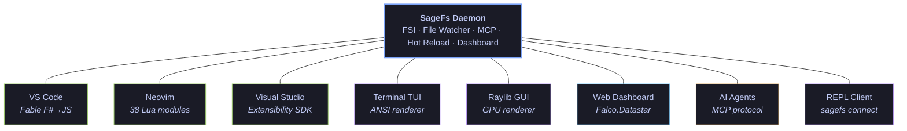
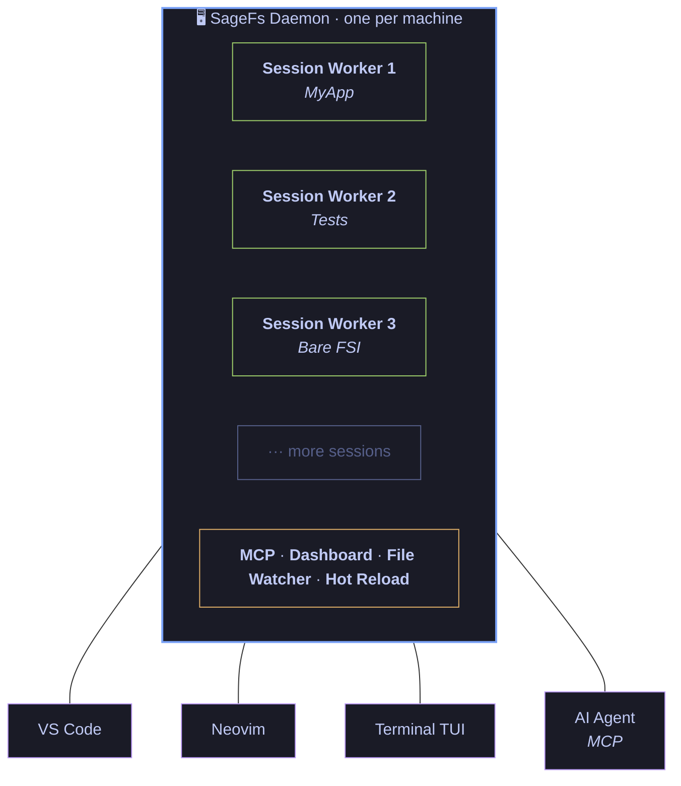

<div align="center">

# SageFs

### You save. Tests pass. Browser updates. Under a second.

A live F# engine — hot reload, live testing, AI-native — for every editor, for free.

[](https://www.nuget.org/packages/SageFs/)
[](https://dotnet.microsoft.com)
[](LICENSE)
[]()
[]()

</div>

<!-- TODO: Record hero GIF showing: edit F# in VS Code → save → gutter markers flash green → browser refreshes. 6-8 seconds, one take. -->
<!-- <p align="center"></p> -->

<br/>

> ### 🆕 Never written F#? You're in the right place.
>
> Pick your language — each guide maps familiar concepts to F#, with runnable examples that show results the instant you press Alt+Enter.
>
> 🐍 [Python](#-coming-from-python) · 📓 [Jupyter](#-coming-from-jupyter-notebooks) · 🔷 [C#](#-coming-from-c) · ☕ [Java](#-coming-from-java) · 🟨 [JS/TS](#-coming-from-javascript--typescript) · 🦀 [Rust](#-coming-from-rust) · 🧘 [F# Koans](#-coming-from-fsharpkoans)
>
> Or just dive in: `dotnet tool install --global SageFs && sagefs` — then open any `.fsx` file and hit Alt+Enter.

---

## The $3,000/year Feature — Free

Visual Studio Enterprise charges **~$250/month per seat** for Live Unit Testing. That's **$3,000/year per developer.** It only works in Visual Studio. It only supports 3 frameworks. It takes 5-30 seconds. It requires your code to compile.

SageFs does it better. In every editor. In under 500ms. On broken code. For free.

| | VS Enterprise Live Testing | **SageFs** |
|:---|:---|:---|
| **Speed** | 5–30 sec (MSBuild rebuild) | **200–500ms** (FSI hot eval) |
| **Broken code** | ✗ Must compile first | **✓ Tree-sitter works on incomplete code** |
| **Scope** | Rebuilds all impacted projects | **Function-level** — just what changed |
| **Frameworks** | MSTest · xUnit · NUnit | **+ Expecto · TUnit · xUnit v3** · extensible |
| **Coverage** | IL instrumentation (heavy) | **Dual:** symbol dependency graph + IL branch probes |
| **Editors** | Visual Studio only | **VS Code · Neovim · TUI · GUI · Visual Studio · Web** |
| **Price** | ~$250/month | **Free, MIT licensed** |

```
✓ let ``should add two numbers`` () =       ← passed (12ms)
✗ let ``should reject negative`` () =       ← failed: Expected Ok but got Error
● let ``should handle empty`` () =          ← detected, not yet run
▸ let validate x =                          ← covered by 3 tests, all passing
○ let unusedHelper () = ()                  ← not reached by any test
```

<details>
<summary><strong>Three-speed feedback pipeline — how sub-500ms works</strong></summary>

<br />

1. **~50ms** — Tree-sitter detects test attributes in broken/incomplete code → immediate gutter markers
2. **~350ms** — F# Compiler Service type-checks → dependency graph, reachability annotations
3. **~500ms** — Affected-test execution via hot-eval → ✓/✗ results inline

Tests are auto-categorized (Unit, Integration, Browser, Property, Benchmark) with smart run policies — unit tests run on every keystroke, integration on save, browser on demand. All configurable.

</details>

---

## Three Things That Change Everything

### ⚡ Hot Reload — Save and It's Live

Save a `.fs` file. SageFs reloads it in ~100ms via [Harmony](https://github.com/pardeike/Harmony) runtime patching. No rebuild. No restart. Connected browsers auto-refresh via SSE. Your web app is already showing the new code before your fingers leave the keyboard.

### 🤖 AI-Native — Your Agent Can Compile

SageFs exposes a [Model Context Protocol](https://modelcontextprotocol.io/) server with an **affordance-driven state machine** — AI agents only see tools valid for the current session state. No wasted tokens guessing. Copilot, Claude, and any MCP client can execute F# code, type-check, explore .NET APIs, and run tests against your real project.

### 🖥️ One Daemon, Every Editor — Simultaneously

Start SageFs once. Connect from VS Code, Neovim, Visual Studio, a terminal TUI, a GPU-rendered Raylib GUI, a web dashboard, or an AI agent. Open them all at the same time — they share the same live session. Switch editors without switching tools.


```mermaid
graph TB
    D["<b>SageFs Daemon</b><br/>FSI · File Watcher · MCP · Hot Reload · Dashboard"]

    D --- VS["VS Code<br/><i>Fable F#→JS</i>"]
    D --- NV["Neovim<br/><i>38 Lua modules</i>"]
    D --- VI["Visual Studio<br/><i>Extensibility SDK</i>"]
    D --- TU["Terminal TUI<br/><i>ANSI renderer</i>"]
    D --- GU["Raylib GUI<br/><i>GPU renderer</i>"]
    D --- WB["Web Dashboard<br/><i>Falco.Datastar</i>"]
    D --- AI["AI Agents<br/><i>MCP protocol</i>"]
    D --- RP["REPL Client<br/><i>sagefs connect</i>"]

    style D fill:#1a1b26,stroke:#7aa2f7,stroke-width:2px,color:#c0caf5
    style VS fill:#1a1b26,stroke:#9ece6a,color:#c0caf5
    style NV fill:#1a1b26,stroke:#9ece6a,color:#c0caf5
    style VI fill:#1a1b26,stroke:#9ece6a,color:#c0caf5
    style TU fill:#1a1b26,stroke:#bb9af7,color:#c0caf5
    style GU fill:#1a1b26,stroke:#bb9af7,color:#c0caf5
    style WB fill:#1a1b26,stroke:#7dcfff,color:#c0caf5
    style AI fill:#1a1b26,stroke:#e0af68,color:#c0caf5
    style RP fill:#1a1b26,stroke:#bb9af7,color:#c0caf5
```

---

## Mental Model — How SageFs Works

SageFs has exactly **three concepts**: a daemon, sessions, and clients.


```mermaid
graph TB
    subgraph D["🖥️  SageFs Daemon  ·  one per machine"]
        S1["<b>Session Worker 1</b><br/><i>MyApp</i>"]
        S2["<b>Session Worker 2</b><br/><i>Tests</i>"]
        S3["<b>Session Worker 3</b><br/><i>Bare FSI</i>"]
        SX["···  more sessions"]
        SVC["<b>MCP</b> · <b>Dashboard</b> · <b>File Watcher</b> · <b>Hot Reload</b>"]
    end

    D --- VS["VS Code"]
    D --- NV["Neovim"]
    D --- TU["Terminal TUI"]
    D --- AI["AI Agent<br/><i>MCP</i>"]

    style D fill:#1a1b26,stroke:#7aa2f7,stroke-width:2px,color:#c0caf5
    style S1 fill:#1a1b26,stroke:#9ece6a,color:#c0caf5
    style S2 fill:#1a1b26,stroke:#9ece6a,color:#c0caf5
    style S3 fill:#1a1b26,stroke:#9ece6a,color:#c0caf5
    style SX fill:#1a1b26,stroke:#565f89,color:#565f89
    style SVC fill:#1a1b26,stroke:#e0af68,color:#c0caf5
    style VS fill:#1a1b26,stroke:#bb9af7,color:#c0caf5
    style NV fill:#1a1b26,stroke:#bb9af7,color:#c0caf5
    style TU fill:#1a1b26,stroke:#bb9af7,color:#c0caf5
    style AI fill:#1a1b26,stroke:#bb9af7,color:#c0caf5
```

**The daemon is a service.** It starts bare — no project, no session. It just listens. Clients tell it what to do.

**Sessions are isolated workers.** Each session is a separate OS process with its own FSI instance, its own loaded project, its own file watcher. They can't interfere with each other. Create as many as you need.

**Clients are thin.** Your editor plugin, the TUI, an AI agent — they all connect to the same daemon. They create sessions, send code, read results. Multiple clients can share the same session or each use their own.

**The workflow:**

1. Start the daemon: `sagefs`
2. A client (editor, CLI, AI) creates a session: `POST /api/sessions/create` with a project path
3. The daemon spawns a worker, loads the project, starts watching files
4. The client sends code, reads diagnostics, runs tests — all through the daemon
5. Other clients can connect to the same session simultaneously

This means **the daemon doesn't need to know your project at startup**. It discovers projects when clients ask for sessions. You can run `sagefs` with no arguments in any directory and it's ready for any project.

---

## Get Started

**Prerequisites:** [.NET 10 SDK](https://dotnet.microsoft.com/download/dotnet/10.0). That's it.

```bash
# Install
dotnet tool install --global SageFs

# Start the daemon (in any directory)
sagefs
```

**What happens next:**

1. The daemon starts and prints its endpoints (MCP, dashboard, health)
2. Open your editor — VS Code, Neovim, and Visual Studio auto-start sessions for your open project
3. Edit an F# file and save — live test results appear in your editor within 500ms
4. Or visit the **dashboard** at `http://localhost:37750/dashboard` to see everything live

```
MCP endpoint:  http://localhost:37749/sse    ← connect AI agents here
Dashboard:     http://localhost:37750/dashboard  ← live web UI
```

No project flag needed — the daemon discovers projects when your editor (or an AI agent) creates a session.

> **New to F#?** You don't need any F# knowledge to start. Jump to the [migration guide for your language](#welcome-traveler----pick-your-home-language) — each one maps concepts you already know to F#, with runnable examples.
> 🐍 Python · 📓 Jupyter · 🔷 C# · ☕ Java · 🟨 JS/TS · 🦀 Rust · 🧘 [F# Koans](#-coming-from-fsharpkoans) (21 guided exercises)

<details>
<summary>Build from source</summary>

```bash
git clone https://github.com/WillEhrendreich/SageFs.git
cd SageFs
dotnet build && dotnet pack SageFs -o nupkg
dotnet tool install --global SageFs --add-source ./nupkg --no-cache
```

</details>

---

## What You Get in Each Editor

Every frontend connects to the same daemon. Open several at once — they all see the same state.

| Capability | VS Code | Neovim | Visual Studio | TUI | Raylib GUI | Web | AI (MCP) |
|:---|:---:|:---:|:---:|:---:|:---:|:---:|:---:|
| Eval code / file / block | ✅ | ✅ | ✅ | ✅ | ✅ | ✅ | ✅ |
| Inline results | ✅ | ✅ | ✅ | ✅ | ✅ | ✅ | ✅ |
| Live diagnostics (SSE) | ✅ | ✅ | ✅ | ✅ | ✅ | ✅ | ✅ |
| Hot reload toggle | ✅ | ✅ | ✅ | ✅ | ✅ | ✅ | — |
| Session management | ✅ | ✅ | ✅ | ✅ | ✅ | ✅ | ✅ |
| Code completion | ✅ | ✅ | ¹ | ✅ | ✅ | ✅ | ✅ |
| CodeLens | ✅ | ✅ | ✅ | — | — | — | — |
| **Live test gutters** | ✅ | ✅ | ¹ | ✅ | ¹ | — | — |
| **Coverage gutters** | ¹ | ✅ | ¹ | ✅ | ¹ | — | — |
| Test panel | ✅ | ✅ | — | — | — | — | — |
| Test policy controls | ✅ | ✅ | — | — | — | — | ✅ |
| Type explorer | ✅ | ✅ | — | — | — | — | ✅ |
| Call graph | ✅ | ✅ | — | — | — | — | — |
| History browser | ✅ | ✅ | — | — | — | — | — |
| Test trace | ✅ | ✅ | — | — | — | — | ✅ |

> ¹ Server-side data ready. Editor UI integration pending (VS SDK limitations or work-in-progress).

<details>
<summary><strong>Editor setup guides</strong></summary>

#### VS Code

The extension is distributed as a `.vsix` from [GitHub Releases](https://github.com/WillEhrendreich/SageFs/releases). Written entirely in F# via [Fable](https://fable.io/) — no TypeScript.

```bash
code --install-extension sagefs-<version>.vsix
```

Features: Alt+Enter eval, CodeLens, live test decorations, native Test Explorer integration, hot reload sidebar, session context, type explorer, call graph, event history, dashboard webview, status bar, auto-start, and Ionide command hijacking.

#### Neovim

[**sagefs.nvim**](https://github.com/WillEhrendreich/sagefs.nvim) — 38 Lua modules, 1142 tests, 46 commands.

```lua
-- lazy.nvim
{ "WillEhrendreich/sagefs.nvim", ft = { "fsharp" }, opts = { port = 37749, auto_connect = true } }
```

Features: Cell eval, inline results, gutter signs, SSE live updates, live test panel, coverage panel with per-file breakdown, type explorer, call graph, history browser, session export to `.fsx`, code completion, branch coverage gutters, filterable test panel, display density presets, and combined statusline component.

#### Visual Studio

Uses the [VisualStudio.Extensibility](https://learn.microsoft.com/en-us/visualstudio/extensibility/visualstudio.extensibility/) SDK with F# core logic. Early development — eval, CodeLens, session management, and diagnostics work. Live testing gutters and advanced features are in progress.

The VS extension includes kill switches for individual features. See the [VS Extension README](sagefs-vs/README.md#kill-switches) for details.

#### AI Agent (MCP)

SageFs exposes 30 MCP tools — from `send_fsharp_code` to `run_tests` to `explore_type`. Any MCP client can connect.

**Streamable HTTP** (recommended — auto-reconnects, no session drops):
```json
{ "mcpServers": { "sagefs": { "type": "streamable-http", "url": "http://localhost:37749/" } } }
```

**SSE** (legacy clients that don't support Streamable HTTP yet):
```json
{ "mcpServers": { "sagefs": { "type": "sse", "url": "http://localhost:37749/sse" } } }
```

<details>
<summary>Per-client config examples</summary>

**GitHub Copilot (CLI)** — `~/.copilot/github-copilot/mcp.json`:
```json
{ "servers": { "sagefs": { "type": "sse", "url": "http://localhost:37749/sse" } } }
```

**Claude Code** — `~/.claude/claude_desktop_config.json`:
```json
{ "mcpServers": { "sagefs": { "type": "sse", "url": "http://localhost:37749/sse" } } }
```

**Windsurf / Cursor** — `.cursor/mcp.json` or Windsurf MCP settings:
```json
{ "mcpServers": { "sagefs": { "type": "sse", "url": "http://localhost:37749/sse" } } }
```

**OpenCode** — `mcp.json`:
```json
{ "mcpServers": { "sagefs": { "url": "http://localhost:37749/sse" } } }
```

</details>

Works with GitHub Copilot (CLI & VS Code), Claude Code, Claude Desktop, OpenCode, Windsurf, Cursor, and any MCP-compatible tool. The **edit → auto-test → poll** workflow means agents don't even need to call eval — just edit files and check `get_live_test_status`.

#### TUI / GUI / Web Dashboard / REPL

```bash
sagefs tui       # Multi-pane terminal UI with tree-sitter highlighting
sagefs gui       # GPU-rendered Raylib window (same layout as TUI)
sagefs connect   # Text REPL connected to running daemon
# Dashboard auto-starts at http://localhost:37750/dashboard
```

</details>

---

## Under the Hood

<details>
<summary><strong>🔥 Hot Reload — how it works</strong></summary>

<br />

1. File watcher detects `.fs`/`.fsx` changes (~500ms debounce)
2. `#load` sends the file to FSI (~100ms)
3. [Harmony](https://github.com/pardeike/Harmony) patches method pointers at runtime — no restart
4. SSE pushes a reload signal to connected browsers

**Zero config for web apps.** SageFs auto-injects DevReload middleware into your ASP.NET pipeline via [Harmony](https://github.com/pardeike/Harmony) — no code changes needed. Your Falco/ASP.NET app gets browser auto-refresh the moment SageFs is running. If something breaks, an accessible error overlay appears in the browser with source context, editor links, and smart auto-reload when the error is fixed.

Set `SAGEFS_DEVRELOAD=0` to disable auto-injection if needed.

The VS Code extension gives per-file and per-directory hot reload toggles.

See [HOT_RELOAD_STATUS.md](HOT_RELOAD_STATUS.md) for the full technical deep-dive.

</details>

<details>
<summary><strong>🔀 Multi-Session — isolated worker processes</strong></summary>

<br />

Run multiple F# sessions simultaneously — different projects, different states. Each session is an **isolated worker sub-process** (Erlang-style fault isolation). SSE events are tagged with `SessionId` — no cross-talk between editor windows watching different projects. Create, switch, and stop sessions from any frontend.

</details>

<details>
<summary><strong>🛡️ Supervised Mode — crash-proof development</strong></summary>

<br />

```bash
sagefs --supervised
```

Erlang-style supervisor with exponential backoff (1s → 2s → 4s → max 30s). After 5 consecutive crashes within 5 minutes, it reports the failure. Watchdog state exposed via `/api/system/status` and shown in the VS Code status bar. Use this when leaving SageFs running all day.

</details>

<details>
<summary><strong>⚡ Standby Pool — instant hard resets</strong></summary>

<br />

SageFs maintains a pool of pre-warmed FSI sessions. Hard resets swap the active session for an already-warm one — near-instant recovery instead of a 30-60 second rebuild.

</details>


<details>
<summary><strong>💾 Binary Session Persistence — instant resume</strong></summary>

<br />

SageFs persists session state and test caches to compact binary files (`.sagefs` v3, `.sagetc` v1) for near-instant cold starts. No JSON parsing, no database — raw binary with CRC-32C integrity checking.

- **Session files** (`.sagefs`): Full session state — interactions, diagnostics, outputs, eval timeline
- **Test cache files** (`.sagetc`): Test discovery results, outcomes, durations, bitmaps of affected tests
- **Session isolation**: Each session writes to its own file, verified by 118 property-based tests including concurrent write safety

Design: length-prefixed strings, section headers with byte-count envelopes, version negotiation, and field-level bounds checking prevent OOM from crafted inputs.

</details>

<details>
<summary><strong>🤖 MCP Tools Reference — full list</strong></summary>

<br />

| Tool | Description |
|:---|:---|
| `send_fsharp_code` | Execute F# code. Each `;;` is a transaction boundary. |
| `check_fsharp_code` | Type-check a snippet without executing. Code is checked in the current FSI session context — prior `send_fsharp_code` definitions are in scope, but namespaces must be explicitly opened. "Not defined" errors usually mean a missing `open`, not a real bug. |
| `get_completions` | Code completions at cursor position. |
| `cancel_eval` | Cancel a running evaluation. |
| `load_fsharp_script` | Load `.fsx` with partial progress. |
| `get_recent_fsi_events` | Recent evals, errors, loads with timestamps. |
| `get_fsi_status` | Session health, loaded projects, affordances. |
| `get_startup_info` | Projects, features, CLI arguments. |
| `get_available_projects` | Discover `.fsproj`/`.sln`/`.slnx` files. |
| `explore_namespace` | Browse types in a .NET namespace. |
| `explore_type` | Browse members of a .NET type. |
| `get_elm_state` | Current UI render state. |
| `reset_fsi_session` | Soft reset — clear definitions, keep DLLs. |
| `hard_reset_fsi_session` | Full reset — rebuild, reload, fresh session. |
| `create_session` | Create an isolated FSI session. |
| `list_sessions` | List all active sessions. |
| `stop_session` | Stop a session by ID. |
| `switch_session` | Switch active session. |
| `enable_live_testing` | Turn on live unit testing. |
| `disable_live_testing` | Turn off live unit testing. |
| `get_live_test_status` | Test state with optional file filter. |
| `run_tests` | Run tests by pattern or category. Waits up to 15s for hot reload to complete first. |
| `set_run_policy` | Auto-run policy per category (every/save/demand/disabled). |
| `set_test_timeouts` | Configure per-test and global run timeouts. |
| `get_test_trace` | Test cycle timing waterfall. |
| `explain_test_run` | Why a test was selected to run — trigger reason, changed symbols, flaky status. |
| `explain_test_failure` | Enriched failure context for a test that recently went Passed→Failed. |
| `query_test_coverage` | Which tests transitively cover a given symbol via the dependency graph. |
| `get_file_coverage` | Per-line coverage data for a file — bitmap + dependency graph synthesis. |
| `visualize_domain_model` | Visualize a discriminated union type as a state machine diagram. |

</details>

<details>
<summary><strong>📋 CLI Reference</strong></summary>

<br />

```
Usage: sagefs [options]                Start daemon (bare, waits for clients)
       sagefs --supervised [options]   Start with watchdog auto-restart
       sagefs tui                      Terminal UI (starts daemon if needed)
       sagefs gui                      GPU GUI via Raylib (starts daemon if needed)
       sagefs stop                     Stop running daemon
       sagefs status                   Show daemon info

Daemon options:
  --no-resume       Skip restoring previous sessions on startup
  --no-watch        Disable file watching for all sessions
  --prune           Mark all stale sessions as stopped, then exit
  --supervised      Auto-restart on crash (exponential backoff)
  --mcp-port PORT   Custom MCP port (default: 37749)
```

Sessions are created by clients (editor plugins, AI agents, or the API directly), not by CLI flags. The daemon starts bare and waits.

Full options: `sagefs --help`

</details>

<details>
<summary><strong>🔧 Configuration</strong></summary>

<br />

**Per-directory config** — `.SageFs/config.fsx`:

```fsharp
{ DirectoryConfig.empty with
    Load = Projects ["src/MyApp.fsproj"; "tests/MyApp.Tests.fsproj"]
    AutoOpenNamespaces = false
    InitScript = Some "setup.fsx" }
```

Set `AutoOpenNamespaces = false` to skip warmup auto-opening of namespaces and modules. Because sessions inherit `.SageFs/config.fsx` from the working directory, this opt-out applies across VS Code, Neovim, Visual Studio, the dashboard, TUI, and GUI session creation flows.

Built-in ways to create or edit that config:

- **Dashboard** — enter a working directory, then click **Disable Warmup Auto-Open**
- **TUI / GUI** — focus the sessions UI and press **Ctrl+Alt+A**
- **VS Code** — run **SageFs: Configure Warmup Auto-Open**
- **Visual Studio** — run **SageFs: Configure Warmup Auto-Open**
- **Neovim** — run `:SageFsConfig`

If `.SageFs/config.fsx` does not exist, these affordances create it with:

```fsharp
{ DirectoryConfig.empty with
  AutoOpenNamespaces = false
}
```

If the config already exists, SageFs opens or points you at the file instead of overwriting your existing settings.

**Startup profile** — `~/.SageFs/init.fsx` auto-loads on every session start.

**Precedence:** Per-directory config > auto-discovery from working directory.

</details>

<details>
<summary><strong>❓ Troubleshooting</strong></summary>

<br />

| Problem | Fix |
|:---|:---|
| "SageFs daemon not found" | Ensure daemon is running. `sagefs status` to check. |
| "Session is still starting up" | Wait for ready message. Standby pool speeds subsequent resets. |
| Stale REPL after code changes | `hard_reset_fsi_session` via MCP or `#hard-reset` in REPL. |
| Port already in use | `sagefs stop` or `--mcp-port 8080`. |
| Running in Docker | Set `SAGEFS_BIND_HOST=0.0.0.0`. |
| Hot reload not working | Auto-injected by default. Check `SAGEFS_DEVRELOAD` isn't `0`. Look for `[DevReload]` in daemon logs. |
| SSE connections dropping | Set proxy timeout ≥ 60s. SageFs sends keepalives every 15s. |
| Live testing not running | Check `enable_live_testing` has been called and run policies match expectations. |
| **macOS: SyntaxHighlight init failed** | Tree-sitter native library not yet bundled for macOS/Linux. Syntax highlighting falls back gracefully — all other features work. See [#17](https://github.com/WillEhrendreich/SageFs/issues/17). |
| **macOS: VS Code "cannot read properties of undefined"** | Fixed in v0.5.414+. Update the extension. If daemon can't start, the extension now degrades gracefully instead of crashing. See [#18](https://github.com/WillEhrendreich/SageFs/issues/18). |
| Logs? | Daemon console for real-time. OTEL export for structured traces/metrics. |

</details>

<details>
<summary><strong>⚙️ FSI Quirks & Rewrites</strong></summary>

<br />

SageFs auto-rewrites `use` → `let` inside nested scopes (functions, CEs) because FSI doesn't support `use` in those positions. This means disposables aren't auto-disposed in the REPL — fine for experiments, be aware for long sessions.

Other FSI behaviors: redefinition shadows (doesn't error), `;;` boundaries are independent transactions, no `[<EntryPoint>]`, assembly loading is session-scoped.

Rewrite logic: [`SageFs.Core/FsiRewrite.fs`](SageFs.Core/FsiRewrite.fs) (~25 lines). PRs welcome.

</details>

<details>
<summary><strong>🏗️ Architecture</strong></summary>

<br />

SageFs is **daemon-first** — one server, many clients. The daemon starts bare and creates sessions on demand. Each session is an **isolated worker sub-process** (Erlang-style fault isolation) with its own FSI, project, and file watcher. The TUI and Raylib GUI share the same `Cell[,]` grid rendering abstraction — same keybindings, same layout, different backends.

```
                ┌───────────────┐
                │  SageFs Daemon│
                │  ┌─────────┐  │
                │  │ FSI Actor│  │
                │  │ (Eval +  │  │
                │  │  Query)  │  │
                │  └─────────┘  │
                │  ┌─────────┐  │
                │  │  File    │  │
                │  │ Watcher  │  │
                │  └─────────┘  │
                │  ┌─────────┐  │
                │  │  MCP     │  │
                │  │ Server   │  │
                │  └─────────┘  │
                └──┬──┬──┬──┬───┘
                   │  │  │  │
     ┌──────┐  ┌──┴┐ ┌┴──┐ ┌┴──────┐  ┌────────┐
     │VS Code│  │TUI│ │GUI│ │ Web   │  │AI Agent│
     │Plugin │  │   │ │   │ │ Dash  │  │ (MCP)  │
     └──────┘  └───┘ └───┘ └───────┘  └────────┘
     ┌──────┐  ┌───────┐
     │Neovim│  │ REPL  │
     │Plugin│  │Connect│
     └──────┘  └───────┘
```

3500+ tests: Expecto unit tests, FsCheck property-based state machine tests, Verify snapshots, binary persistence property tests.

</details>

---

## Welcome, Traveler 👋 — Pick Your Home Language

SageFs isn't just for F# veterans. It's for anyone who's ever thought *"why is development this slow?"* — regardless of what language burned them first. Find your background below, grab your starter sample, and hit Alt+Enter.

> **Quick orientation:** Every sample in [`/samples`](samples/) is a runnable `.fsx` script.
> Open it in VS Code with the SageFs extension (or `sagefs tui`), hit **Alt+Enter** on any expression, and results appear inline. Instantly.

---

### 🐍 Coming from Python?

You already love interactive development — you live in the REPL. F# gives you the same energy, plus a compiler that catches your bugs before you run anything, blazing-fast pipelines instead of list comprehensions, and a type system that makes refactoring feel like a superpower instead of a minefield.

Pain you're leaving behind: `AttributeError: 'NoneType' object has no attribute 'foo'`, mystery runtime crashes, and the "just run it and see" debugging loop.

**What you'll love immediately:**
- `|>` pipelines read like Python chains, but faster and type-checked
- Pattern matching makes `if/elif/elif/elif/else` forests extinct
- `Option<'T>` means `None` is handled at compile time — no more surprise crashes
- SageFs = your Jupyter notebook, but in your editor, with live tests and hot reload

**→ [Start here: `samples/from-python/hello.fsx`](samples/from-python/hello.fsx)**

```fsharp
// From this (Python):
// result = sum(x**2 for x in range(1, 11) if x % 2 == 0)

// To this (F#):
let result =
  [1..10]
  |> List.filter (fun x -> x % 2 = 0)
  |> List.map    (fun x -> x * x)
  |> List.sum
// Alt+Enter → 220. No running the file. No print(). Just results.
```

---

### 📓 Coming from Jupyter Notebooks?

You're already living the interactive-first dream. SageFs takes everything you love about notebooks (eval any expression, see results inline, build understanding iteratively) and fixes everything you hate (kernel crashes, "restart and run all", the JSON-blob hell of version control, no type checking, no hot reload into production).

Pain you're leaving behind: "the kernel died", cell execution order mysteries, `git diff` on `.ipynb` showing base64 blobs, and the chasm between notebook exploration and shipped code.

**What you'll love immediately:**
- Alt+Enter on *any* expression — not just at the end of a cell
- Your code is a real `.fsx` file that `git diff` shows beautifully
- Write Expecto tests alongside your analysis — they run on every save
- When you're ready to ship, your exploration code *is* the production code

**→ [Start here: `samples/from-jupyter/notebook.fsx`](samples/from-jupyter/notebook.fsx)**

```fsharp
// Your "cell" is any expression. Run it anywhere.
let data = [1.0; 2.0; 3.0; 4.0; 5.0]
let mean = data |> List.average     // Alt+Enter → 3.0, right in the gutter
let std  =
  data
  |> List.map (fun x -> (x - mean) ** 2.0)
  |> List.average
  |> sqrt                           // Alt+Enter → 1.414...
```

---

### 🔷 Coming from C#?

You're already home. Same .NET runtime. Same NuGet packages. Same `dotnet` CLI. You just get to stop writing `public class AbstractRepositoryFactoryImpl` and start writing code that says what it means.

Pain you're leaving behind: 50-line classes for 3-line concepts, null reference exceptions at 3am, `dotnet watch` rebuilding for 10 seconds when you fix a typo, and writing the same LINQ query 12 different ways because the extension method didn't exist.

**What you'll love immediately:**
- Records are immutable value objects with equality built in — one line
- Discriminated unions make `sealed class + pattern matching` elegant instead of painful
- `Result<'T, 'TError>` replaces `try/catch` spaghetti for expected failure paths
- SageFs hot reload patches method pointers at runtime — no rebuild, no restart

**→ [Start here: `samples/from-csharp/hello.fsx`](samples/from-csharp/hello.fsx)**

```fsharp
// C#: public record Person(string Name, int Age);  // 1 line in modern C#
// F#: one line too, but with structural equality, hashCode, and copy-with:
type Person = { Name: string; Age: int }

let alice = { Name = "Alice"; Age = 30 }
let older  = { alice with Age = 31 }   // alice is unchanged — immutability is the default
```

---

### ☕ Coming from Java?

Welcome. You've been writing `AbstractSingletonProxyFactoryBean` and we won't judge you — the ecosystem made you do it. But it's time. F# is what Java always wished it could be: expressive, type-safe, concise, and running on a genuinely great runtime (.NET, not JVM — yes, the GC is better).

Pain you're leaving behind: 10 files for one feature, XML everywhere, Spring Boot startup time, `Optional<Optional<List<? extends Comparable<? super T>>>>`, and `NullPointerException` at line 1 of your stack trace.

**What you'll love immediately:**
- A `Person` record is one line. Getters, equals, hashCode, toString — free.
- Pattern matching on sealed types, with exhaustiveness checking — the Java 21 feature, but good
- No `Optional.ofNullable(x).map(f).orElse(null)` — `Option<'T>` is a language citizen
- Build time: `dotnet build` is fast. SageFs day-to-day: no build at all.

**→ [Start here: `samples/from-java/hello.fsx`](samples/from-java/hello.fsx)**

```fsharp
// Java: public record Person(String name, int age) {}  +  equals + hashCode + toString
// F#:
type Person = { Name: string; Age: int }
// structural equality: { Name = "Alice"; Age = 30 } = { Name = "Alice"; Age = 30 } → true
// toString: printfn "%A" { Name = "Alice"; Age = 30 } → { Name = "Alice"; Age = 30 }
// No Lombok. No Jackson annotations. Just data.
```

---

### 🟨 Coming from JavaScript / TypeScript?

You've been shipping `undefined is not a function` to production for years, and you've made peace with it. F# offers you something radical: a language where the type system is actually on your side, where `undefined` is not a concept, and where hot reload is so fast it feels like cheating.

Pain you're leaving behind: `node_modules` eating your disk, `any` creep in TypeScript, `undefined` vs `null` vs `""` vs `0` all being falsy, and webpack rebuilds that take longer than your lunch break.

**What you'll love immediately:**
- `Option<'T>` means "might not exist" — compiler-enforced, no runtime surprise
- `|>` pipelines are `.filter().map().reduce()` but for *any* function, not just array methods
- No `this` binding bugs — functions are just functions
- Fable compiles F# to clean JavaScript — the SageFs VS Code extension is F# all the way down

**→ [Start here: `samples/from-javascript/hello.fsx`](samples/from-javascript/hello.fsx)**

```fsharp
// JS/TS: type Shape = { kind: "circle"; r: number } | { kind: "rect"; w: number; h: number }
// F# (compiler checks exhaustiveness — no forgotten cases at runtime):
type Shape =
  | Circle    of radius: float
  | Rectangle of width: float * height: float

let area = function
  | Circle r          -> System.Math.PI * r * r
  | Rectangle (w, h) -> w * h
// Forget the Rectangle case? Warning. Add Triangle without updating area? Warning.
```

---

### 🦀 Coming from Rust?

You're going to feel right at home. `Option`, `Result`, pattern matching, discriminated unions, immutability by default, zero `null` — F# and Rust share the same design philosophy. The difference is that F# runs on .NET, skips the borrow checker, and gives you hot reload and interactive scripting.

Pain you're leaving behind: borrow checker fights for straightforward code, 45-second compile times for medium projects, no REPL, and having to reach for Python every time you want to explore data.

**What you'll love immediately:**
- `Option<'T>`, `Result<'T, 'E>`, and exhaustive pattern matching — just like Rust
- Records and DUs have structural equality by default — no `#[derive(PartialEq)]` needed
- Hot reload: your running program patches itself on save — impossible in Rust, trivial here
- `.fsx` scripts give you the interactive exploration story Rust has always lacked

**→ [Start here: `samples/from-rust/hello.fsx`](samples/from-rust/hello.fsx)**

```fsharp
// Rust: enum Shape { Circle { radius: f64 }, Rectangle { width: f64, height: f64 } }
// F#:
type Shape =
  | Circle    of radius: float
  | Rectangle of width: float * height: float

// match is exhaustive just like Rust — add a case, get a warning everywhere it's not handled
let area = function
  | Circle r          -> System.Math.PI * r * r
  | Rectangle (w, h) -> w * h
```

---

### 🧘 Coming from FSharpKoans?

Congratulations, graduate — you've already proven you know F#. You filled in the blanks, matched the patterns, piped the lists. But the Koans workflow was also kind of... slow? `dotnet watch run`, squint at terminal output, scroll to find which koan broke, fix it, wait 3 seconds, repeat. SageFs is the upgrade: same F# you learned, but with instant inline feedback, live test gutter markers, and no more terminal-squinting.

Pain you're leaving behind: The 2-4 second `dotnet watch run` cycle, terminal-only pass/fail output, the custom `[<Koan>]` framework that doesn't work anywhere else, and the gap between "I finished the exercises" and "I can build real things."

**What you'll love immediately:**
- Alt+Enter on any expression → result appears inline, not in the terminal
- Expecto tests with live gutter markers (✓/✗) — the natural evolution of koan assertions
- No more `dotnet run` cycles — feedback in ~200ms
- Your koan-learned skills (DUs, pipelines, options, pattern matching) applied to real domains

**→ [Start here: `samples/from-koans/00-about-sagefs-koans.fsx`](samples/from-koans/00-about-sagefs-koans.fsx)** (the roadmap — then work through `01-about-asserts.fsx` → `21-about-filtering.fsx` at your own pace)

```fsharp
// Koans taught you this:
//     let actual_value = __
//     AssertEquality expected_value actual_value
//     dotnet run → FAIL → fix → run → PASS → next (~3 sec cycle)

// SageFs: just evaluate it.
let x = 1 + 1   // Alt+Enter → 2, right here, in ~200ms

// Your DU skills, applied to a real domain:
type OrderStatus =
    | Pending | Shipped of tracking: string | Cancelled of reason: string

let describe = function
    | Pending    -> "⏳ Awaiting shipment"
    | Shipped t  -> $"📦 {t}"
    | Cancelled r -> $"❌ {r}"
// Alt+Enter → instant result. No test framework needed for exploration.
```

---

### 🎯 Visual Demos

See what SageFs makes possible beyond the REPL:

#### 🌐 Reactive Web App — Falco + Datastar, zero JavaScript

A full CRUD todo app in ~100 lines of F#. Edit a handler, save — the browser updates before you look away. No webpack. No bundler. No framework ceremony.

**→ [`samples/demos/webapp-datastar.fsx`](samples/demos/webapp-datastar.fsx)**

#### 🎨 GPU Window — Raylib Hello World with hot reload

A Raylib window that hot-patches on save. Change the color, the text, the animation — save — it's live in the *running window*. No restart, no flicker.

**→ [`samples/demos/raylib-hello.fsx`](samples/demos/raylib-hello.fsx)**

#### 🕹️ Interactive Game — live-tweakable physics

A playable star-catcher game. Edit `starMaxSpeed`, `playerWidth`, `starColors` in the source file, save, and the changes apply to the *running game* without interrupting play. This is what live development actually feels like.

**→ [`samples/demos/raylib-game.fsx`](samples/demos/raylib-game.fsx)**

---

## Contributing

SageFs is open source and we welcome contributions! Whether it's a bug fix, documentation improvement, new test, or a whole feature — PRs are encouraged.

**→ [Read the Contributing Guide](CONTRIBUTING.md)** for setup instructions, debugging workflow, coding standards, and how to make your first PR.

New to the codebase? Check the **Good First Contributions** section in the contributing guide for places where help is especially welcome.

## License

[MIT](LICENSE)

## Acknowledgments

SageFs exists because of Jo Van Eyck's [fsi-mcp-server](https://github.com/jovaneyck/fsi-mcp-server) — an elegant, minimal F# Interactive MCP server that proved the concept of connecting FSI to editors via MCP. That project was the catalyst that made everything here possible.

[FsiX](https://github.com/soweli-p/FsiX) · [sagefs.nvim](https://github.com/WillEhrendreich/sagefs.nvim) · [Falco](https://github.com/pimbrouwers/Falco) & [Falco.Datastar](https://github.com/spiraloss/Falco.Datastar) · [Harmony](https://github.com/pardeike/Harmony) · [Ionide.ProjInfo](https://github.com/ionide/proj-info/) · [Raylib-cs](https://github.com/ChrisDill/Raylib-cs) · [Fable](https://fable.io/) · [ModelContextProtocol](https://modelcontextprotocol.io/)
