<div align="center">

# SageFs

### You save. Tests pass. Browser updates. Under a second.

A live F# engine — hot reload, live testing, AI-native — for every editor, for free.

[](https://www.nuget.org/packages/SageFs/)
[](https://dotnet.microsoft.com)
[](LICENSE)
[]()
[]()

</div>

<!-- TODO: Record hero GIF showing: edit F# in VS Code → save → gutter markers flash green → browser refreshes. 6-8 seconds, one take. -->
<!-- <p align="center"></p> -->

<br/>

## The $3,000/year Feature — Free

Visual Studio Enterprise charges **~$250/month per seat** for Live Unit Testing. That's **$3,000/year per developer.** It only works in Visual Studio. It only supports 3 frameworks. It takes 5-30 seconds. It requires your code to compile.

SageFs does it better. In every editor. In under 500ms. On broken code. For free.

| | VS Enterprise Live Testing | **SageFs** |
|:---|:---|:---|
| **Speed** | 5–30 sec (MSBuild rebuild) | **200–500ms** (FSI hot eval) |
| **Broken code** | ✗ Must compile first | **✓ Tree-sitter works on incomplete code** |
| **Scope** | Rebuilds all impacted projects | **Function-level** — just what changed |
| **Frameworks** | MSTest · xUnit · NUnit | **+ Expecto · TUnit** · extensible |
| **Coverage** | IL instrumentation (heavy) | **Dual:** symbol dependency graph + IL branch probes |
| **Editors** | Visual Studio only | **VS Code · Neovim · TUI · GUI · Visual Studio · Web** |
| **Price** | ~$250/month | **Free, MIT licensed** |

```
✓ let ``should add two numbers`` () =       ← passed (12ms)
✗ let ``should reject negative`` () =       ← failed: Expected Ok but got Error
● let ``should handle empty`` () =          ← detected, not yet run
▸ let validate x =                          ← covered by 3 tests, all passing
○ let unusedHelper () = ()                  ← not reached by any test
```

<details>
<summary><strong>Three-speed feedback pipeline — how sub-500ms works</strong></summary>

<br />

1. **~50ms** — Tree-sitter detects test attributes in broken/incomplete code → immediate gutter markers
2. **~350ms** — F# Compiler Service type-checks → dependency graph, reachability annotations
3. **~500ms** — Affected-test execution via hot-eval → ✓/✗ results inline

Tests are auto-categorized (Unit, Integration, Browser, Property, Benchmark) with smart run policies — unit tests run on every keystroke, integration on save, browser on demand. All configurable.

</details>

---

## Three Things That Change Everything

### ⚡ Hot Reload — Save and It's Live

Save a `.fs` file. SageFs reloads it in ~100ms via [Harmony](https://github.com/pardeike/Harmony) runtime patching. No rebuild. No restart. Connected browsers auto-refresh via SSE. Your web app is already showing the new code before your fingers leave the keyboard.

### 🤖 AI-Native — Your Agent Can Compile

SageFs exposes a [Model Context Protocol](https://modelcontextprotocol.io/) server with an **affordance-driven state machine** — AI agents only see tools valid for the current session state. No wasted tokens guessing. Copilot, Claude, and any MCP client can execute F# code, type-check, explore .NET APIs, and run tests against your real project.

### 🖥️ One Daemon, Every Editor — Simultaneously

Start SageFs once. Connect from VS Code, Neovim, Visual Studio, a terminal TUI, a GPU-rendered Raylib GUI, a web dashboard, or an AI agent. Open them all at the same time — they share the same live session. Switch editors without switching tools.

```mermaid
graph TB
    D["<b>SageFs Daemon</b><br/>FSI · File Watcher · MCP · Hot Reload · Dashboard"]

    D --- VS["VS Code<br/><i>Fable F#→JS</i>"]
    D --- NV["Neovim<br/><i>37 Lua modules</i>"]
    D --- VI["Visual Studio<br/><i>Extensibility SDK</i>"]
    D --- TU["Terminal TUI<br/><i>ANSI renderer</i>"]
    D --- GU["Raylib GUI<br/><i>GPU renderer</i>"]
    D --- WB["Web Dashboard<br/><i>Falco.Datastar</i>"]
    D --- AI["AI Agents<br/><i>MCP protocol</i>"]
    D --- RP["REPL Client<br/><i>sagefs connect</i>"]

    style D fill:#1a1b26,stroke:#7aa2f7,stroke-width:2px,color:#c0caf5
    style VS fill:#1a1b26,stroke:#9ece6a,color:#c0caf5
    style NV fill:#1a1b26,stroke:#9ece6a,color:#c0caf5
    style VI fill:#1a1b26,stroke:#9ece6a,color:#c0caf5
    style TU fill:#1a1b26,stroke:#bb9af7,color:#c0caf5
    style GU fill:#1a1b26,stroke:#bb9af7,color:#c0caf5
    style WB fill:#1a1b26,stroke:#7dcfff,color:#c0caf5
    style AI fill:#1a1b26,stroke:#e0af68,color:#c0caf5
    style RP fill:#1a1b26,stroke:#bb9af7,color:#c0caf5
```



---

## Get Started

**Prerequisites:** [.NET 10 SDK](https://dotnet.microsoft.com/download/dotnet/10.0). That's it.

```bash
# Install
dotnet tool install --global SageFs

# Run (in any F# project directory)
sagefs --proj MyApp.fsproj

# Connect from your editor, open the dashboard, or point an AI agent at it
# MCP endpoint:  http://localhost:37749/sse
# Dashboard:     http://localhost:37750/dashboard
```

SageFs builds your project, loads all dependencies into a live FSI session, watches your files, starts the MCP server, and opens the dashboard. You're ready.

<details>
<summary>Build from source</summary>

```bash
git clone https://github.com/WillEhrendreich/SageFs.git
cd SageFs
dotnet build && dotnet pack SageFs -o nupkg
dotnet tool install --global SageFs --add-source ./nupkg --no-cache
```

</details>

---

## What You Get in Each Editor

Every frontend connects to the same daemon. Open several at once — they all see the same state.

| Capability | VS Code | Neovim | Visual Studio | TUI | Raylib GUI | Web | AI (MCP) |
|:---|:---:|:---:|:---:|:---:|:---:|:---:|:---:|
| Eval code / file / block | ✅ | ✅ | ✅ | ✅ | ✅ | ✅ | ✅ |
| Inline results | ✅ | ✅ | ✅ | ✅ | ✅ | ✅ | ✅ |
| Live diagnostics (SSE) | ✅ | ✅ | ✅ | ✅ | ✅ | ✅ | ✅ |
| Hot reload toggle | ✅ | ✅ | ✅ | ✅ | ✅ | ✅ | — |
| Session management | ✅ | ✅ | ✅ | ✅ | ✅ | ✅ | ✅ |
| Code completion | ✅ | ✅ | ¹ | ✅ | ✅ | ✅ | ✅ |
| CodeLens | ✅ | ✅ | ✅ | — | — | — | — |
| **Live test gutters** | ✅ | ✅ | ¹ | ✅ | ¹ | — | — |
| **Coverage gutters** | ¹ | ✅ | ¹ | ✅ | ¹ | — | — |
| Test panel | ✅ | ✅ | — | — | — | — | — |
| Test policy controls | ✅ | ✅ | — | — | — | — | ✅ |
| Type explorer | ✅ | ✅ | — | — | — | — | ✅ |
| Call graph | ✅ | ✅ | — | — | — | — | — |
| History browser | ✅ | ✅ | — | — | — | — | — |
| Pipeline trace | ✅ | ✅ | — | — | — | — | ✅ |

> ¹ Server-side data ready. Editor UI integration pending (VS SDK limitations or work-in-progress).

<details>
<summary><strong>Editor setup guides</strong></summary>

#### VS Code

The extension is distributed as a `.vsix` from [GitHub Releases](https://github.com/WillEhrendreich/SageFs/releases). Written entirely in F# via [Fable](https://fable.io/) — no TypeScript.

```bash
code --install-extension sagefs-<version>.vsix
```

Features: Alt+Enter eval, CodeLens, live test decorations, native Test Explorer integration, hot reload sidebar, session context, type explorer, call graph, event history, dashboard webview, status bar, auto-start, and Ionide command hijacking.

#### Neovim

[**sagefs.nvim**](https://github.com/WillEhrendreich/sagefs.nvim) — 37 Lua modules, 1100+ tests, 48 commands.

```lua
-- lazy.nvim
{ "WillEhrendreich/sagefs.nvim", ft = { "fsharp" }, opts = { port = 37749, auto_connect = true } }
```

Features: Cell eval, inline results, gutter signs, SSE live updates, live test panel, coverage panel with per-file breakdown, type explorer, call graph, history browser, session export to `.fsx`, code completion, branch coverage gutters, filterable test panel, display density presets, and combined statusline component.

#### Visual Studio

Uses the [VisualStudio.Extensibility](https://learn.microsoft.com/en-us/visualstudio/extensibility/visualstudio.extensibility/) SDK with F# core logic. Early development — eval, CodeLens, session management, and diagnostics work. Live testing gutters and advanced features are in progress.

#### AI Agent (MCP)

Connect any MCP client to `http://localhost:37749/sse`:

```json
{ "mcpServers": { "sagefs": { "type": "sse", "url": "http://localhost:37749/sse" } } }
```

Works with GitHub Copilot (CLI & VS Code), Claude Code, Claude Desktop, and any MCP-compatible tool. 23 tools available — from `send_fsharp_code` to `run_tests` to `explore_type`. The **edit → auto-test → poll** workflow means agents don't even need to call eval — just edit files and check `get_live_test_status`.

#### TUI / GUI / Web Dashboard / REPL

```bash
sagefs tui       # Multi-pane terminal UI with tree-sitter highlighting
sagefs gui       # GPU-rendered Raylib window (same layout as TUI)
sagefs connect   # Text REPL connected to running daemon
# Dashboard auto-starts at http://localhost:37750/dashboard
```

</details>

---

## Under the Hood

<details>
<summary><strong>🔥 Hot Reload — how it works</strong></summary>

<br />

1. File watcher detects `.fs`/`.fsx` changes (~500ms debounce)
2. `#load` sends the file to FSI (~100ms)
3. [Harmony](https://github.com/pardeike/Harmony) patches method pointers at runtime — no restart
4. SSE pushes a reload signal to connected browsers

Add `SageFs.DevReloadMiddleware` to your Falco/ASP.NET app for automatic browser refresh:

```fsharp
open SageFs.DevReloadMiddleware
webHost [||] { use_middleware middleware }
```

The VS Code extension gives per-file and per-directory hot reload toggles.

</details>

<details>
<summary><strong>🔀 Multi-Session — isolated worker processes</strong></summary>

<br />

Run multiple F# sessions simultaneously — different projects, different states. Each session is an **isolated worker sub-process** (Erlang-style fault isolation). SSE events are tagged with `SessionId` — no cross-talk between editor windows watching different projects. Create, switch, and stop sessions from any frontend.

</details>

<details>
<summary><strong>🛡️ Supervised Mode — crash-proof development</strong></summary>

<br />

```bash
sagefs --supervised --proj MyApp.fsproj
```

Erlang-style supervisor with exponential backoff (1s → 2s → 4s → max 30s). After 5 consecutive crashes within 5 minutes, it reports the failure. Watchdog state exposed via `/api/system/status` and shown in the VS Code status bar. Use this when leaving SageFs running all day.

</details>

<details>
<summary><strong>⚡ Standby Pool — instant hard resets</strong></summary>

<br />

SageFs maintains a pool of pre-warmed FSI sessions. Hard resets swap the active session for an already-warm one — near-instant recovery instead of a 30-60 second rebuild.

</details>

<details>
<summary><strong>📊 Event Sourcing — durable session history</strong></summary>

<br />

All session events (evals, resets, diagnostics, errors) stored in PostgreSQL via [Marten](https://martendb.io/). Requires Docker + `--persist` flag. Without it, SageFs runs fully in-memory with zero external dependencies.

</details>

<details>
<summary><strong>🤖 MCP Tools Reference — full list</strong></summary>

<br />

| Tool | Description |
|:---|:---|
| `send_fsharp_code` | Execute F# code. Each `;;` is a transaction boundary. |
| `check_fsharp_code` | Type-check without executing. Returns diagnostics. |
| `get_completions` | Code completions at cursor position. |
| `cancel_eval` | Cancel a running evaluation. |
| `load_fsharp_script` | Load `.fsx` with partial progress. |
| `get_recent_fsi_events` | Recent evals, errors, loads with timestamps. |
| `get_fsi_status` | Session health, loaded projects, affordances. |
| `get_startup_info` | Projects, features, CLI arguments. |
| `get_available_projects` | Discover `.fsproj`/`.sln`/`.slnx` files. |
| `explore_namespace` | Browse types in a .NET namespace. |
| `explore_type` | Browse members of a .NET type. |
| `get_elm_state` | Current UI render state. |
| `reset_fsi_session` | Soft reset — clear definitions, keep DLLs. |
| `hard_reset_fsi_session` | Full reset — rebuild, reload, fresh session. |
| `create_session` | Create an isolated FSI session. |
| `list_sessions` | List all active sessions. |
| `stop_session` | Stop a session by ID. |
| `switch_session` | Switch active session. |
| `enable_live_testing` | Turn on live unit testing. |
| `disable_live_testing` | Turn off live unit testing. |
| `get_live_test_status` | Test state with optional file filter. |
| `run_tests` | Run tests by pattern or category. |
| `set_run_policy` | Auto-run policy per category (every/save/demand/disabled). |
| `get_pipeline_trace` | Pipeline timing waterfall. |

</details>

<details>
<summary><strong>📋 CLI Reference</strong></summary>

<br />

```
Usage: sagefs [options]                Start daemon
       sagefs --supervised [options]   Start with watchdog
       sagefs connect                  REPL client
       sagefs tui                      Terminal UI
       sagefs gui                      GPU GUI (Raylib)
       sagefs stop                     Stop daemon
       sagefs status                   Show info

Key options:
  --proj FILE       Load .fsproj
  --sln FILE        Load .sln/.slnx
  --bare            No project, bare FSI
  --supervised      Auto-restart on crash
  --no-watch        Disable file watcher
  --mcp-port PORT   Custom MCP port (default: 37749)
```

Full options: `sagefs --help`

</details>

<details>
<summary><strong>🔧 Configuration</strong></summary>

<br />

**Per-directory config** — `.SageFs/config.fsx`:

```fsharp
{ DirectoryConfig.empty with
    Load = Projects ["src/MyApp.fsproj"; "tests/MyApp.Tests.fsproj"]
    InitScript = Some "setup.fsx" }
```

**Startup profile** — `~/.SageFs/init.fsx` auto-loads on every session start.

**Precedence:** CLI args > `.SageFs/config.fsx` > auto-discovery.

</details>

<details>
<summary><strong>❓ Troubleshooting</strong></summary>

<br />

| Problem | Fix |
|:---|:---|
| "SageFs daemon not found" | Ensure daemon is running. `sagefs status` to check. |
| "Session is still starting up" | Wait for ready message. Standby pool speeds subsequent resets. |
| Stale REPL after code changes | `hard_reset_fsi_session` via MCP or `#hard-reset` in REPL. |
| Port already in use | `sagefs stop` or `--mcp-port 8080`. |
| Running in Docker | Set `SAGEFS_BIND_HOST=0.0.0.0`. |
| Hot reload not working | Ensure `SageFs.DevReloadMiddleware` is in your pipeline. |
| SSE connections dropping | Set proxy timeout ≥ 60s. SageFs sends keepalives every 15s. |
| Live testing not running | Check `set_live_testing` is enabled and run policies match expectations. |
| Logs? | Daemon console for real-time. OTEL export for structured traces/metrics. |

</details>

<details>
<summary><strong>⚙️ FSI Quirks & Rewrites</strong></summary>

<br />

SageFs auto-rewrites `use` → `let` inside nested scopes (functions, CEs) because FSI doesn't support `use` in those positions. This means disposables aren't auto-disposed in the REPL — fine for experiments, be aware for long sessions.

Other FSI behaviors: redefinition shadows (doesn't error), `;;` boundaries are independent transactions, no `[<EntryPoint>]`, assembly loading is session-scoped.

Rewrite logic: [`SageFs.Core/FsiRewrite.fs`](SageFs.Core/FsiRewrite.fs) (~25 lines). PRs welcome.

</details>

<details>
<summary><strong>🏗️ Architecture</strong></summary>

<br />

SageFs is **daemon-first** — one server, many clients. Worker sessions run as isolated sub-processes (Erlang-style fault isolation). The TUI and Raylib GUI share the same `Cell[,]` grid rendering abstraction — same keybindings, same layout, different backends.

```
                ┌───────────────┐
                │  SageFs Daemon│
                │  ┌─────────┐  │
                │  │ FSI Actor│  │
                │  │ (Eval +  │  │
                │  │  Query)  │  │
                │  └─────────┘  │
                │  ┌─────────┐  │
                │  │  File    │  │
                │  │ Watcher  │  │
                │  └─────────┘  │
                │  ┌─────────┐  │
                │  │  MCP     │  │
                │  │ Server   │  │
                │  └─────────┘  │
                └──┬──┬──┬──┬───┘
                   │  │  │  │
     ┌──────┐  ┌──┴┐ ┌┴──┐ ┌┴──────┐  ┌────────┐
     │VS Code│  │TUI│ │GUI│ │ Web   │  │AI Agent│
     │Plugin │  │   │ │   │ │ Dash  │  │ (MCP)  │
     └──────┘  └───┘ └───┘ └───────┘  └────────┘
     ┌──────┐  ┌───────┐
     │Neovim│  │ REPL  │
     │Plugin│  │Connect│
     └──────┘  └───────┘
```

2900+ tests: Expecto unit tests, FsCheck property-based state machine tests, Verify snapshots, Testcontainers integration tests.

</details>

---

## Contributing

SageFs is open source and we welcome contributions! Whether it's a bug fix, documentation improvement, new test, or a whole feature — PRs are encouraged.

**→ [Read the Contributing Guide](CONTRIBUTING.md)** for setup instructions, debugging workflow, coding standards, and how to make your first PR.

New to the codebase? Check the **Good First Contributions** section in the contributing guide for places where help is especially welcome.

## License

[MIT](LICENSE)

## Acknowledgments

[FsiX](https://github.com/soweli-p/FsiX) · [sagefs.nvim](https://github.com/WillEhrendreich/sagefs.nvim) · [Falco](https://github.com/pimbrouwers/Falco) & [Falco.Datastar](https://github.com/spiraloss/Falco.Datastar) · [Harmony](https://github.com/pardeike/Harmony) · [Ionide.ProjInfo](https://github.com/ionide/proj-info/) · [Marten](https://martendb.io/) · [Raylib-cs](https://github.com/ChrisDill/Raylib-cs) · [Fable](https://fable.io/) · [ModelContextProtocol](https://modelcontextprotocol.io/)
