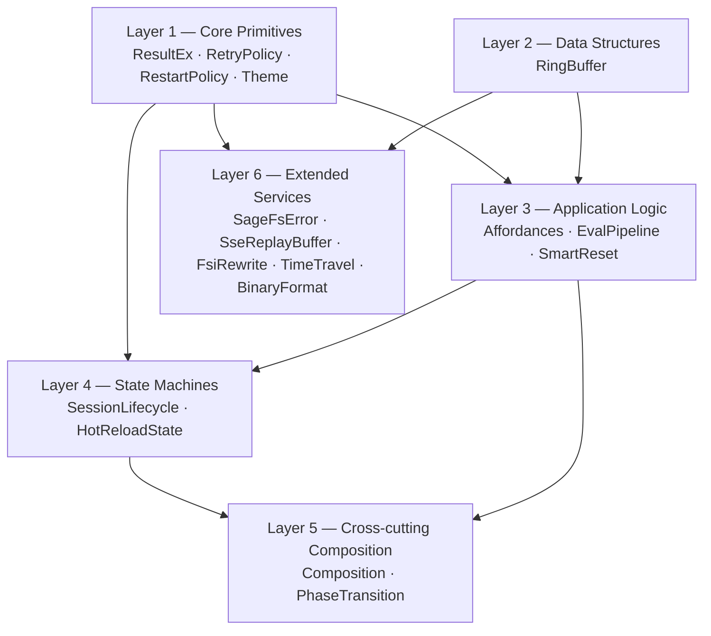
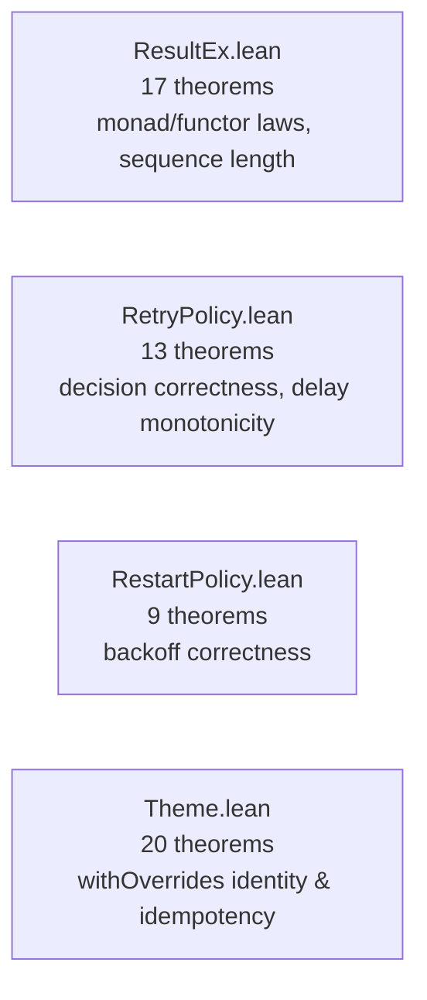
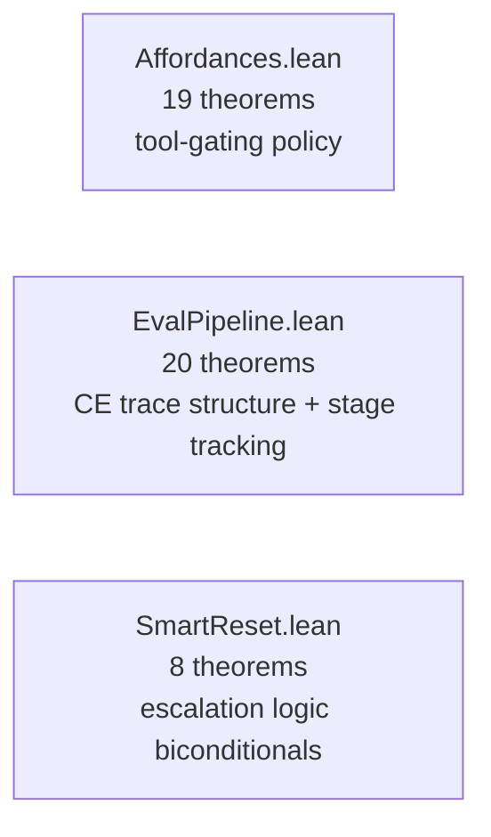
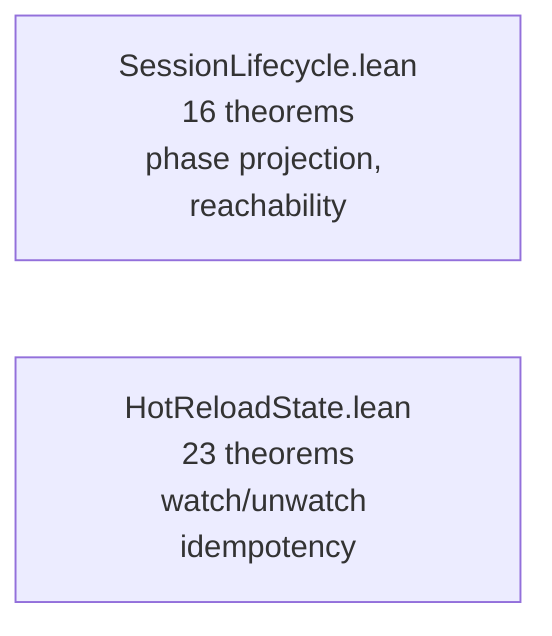
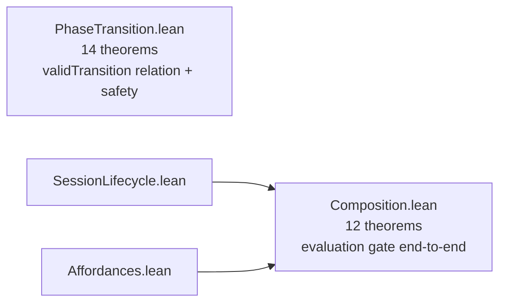
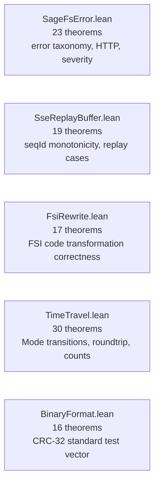
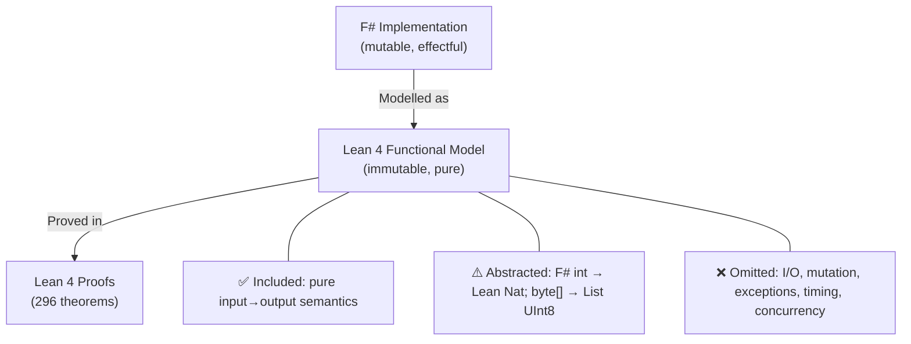
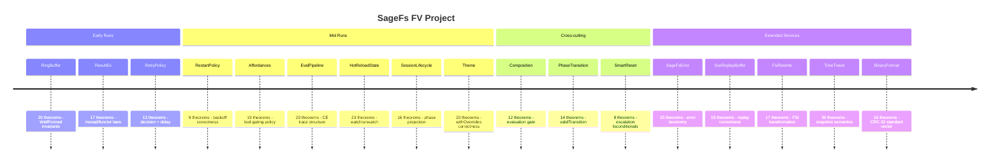

> 🔬 *Lean Squad — automated formal verification for `WillEhrendreich/SageFs`.*

**Status**: ✅ ACTIVE — 296 theorems, 17 Lean files, 0 `sorry`, Lean 4.30.0-rc2.

---

## Last Updated

- **Date**: 2026-05-12 09:17 UTC
- **Commit**: `ef86a4f`

---

## Executive Summary

The SageFs Lean Squad has produced **17 Lean 4 formal specification files** covering
data structures, state machines, error handling, composition, replay buffers, FSI
rewriting, time-travel snapshots, and binary format verification in `SageFs.Core`.
A total of **296 theorems** have been stated and proved with **zero `sorry`** remaining.

The nine base modules verify individual components (Runs 1–9). `Composition.lean` (12)
and `PhaseTransition.lean` (14) add cross-cutting system-level invariants. `SmartReset`
(8), `SageFsError` (23), `SseReplayBuffer` (19), `FsiRewrite` (17), and `TimeTravel`
(30) extend coverage to error handling, replay correctness, FSI code transformations,
and in-memory snapshot semantics. `BinaryFormat.lean` (16) adds algorithmic verification:
the CRC-32 checksum used to validate `.sagefm` binary manifests is proved deterministic,
consistent with the standard test vector (CRC("123456789") = `0xCBF43926`), and
correct for slice operations. A **specification correction** was found: the prior informal
spec stated CRC([0x00]) = `0x2144DF1C`; the correct value is `0xD202EF8D`. No
implementation bugs have been found. The project uses stdlib-only Lean 4 (no Mathlib).

---

## Proof Architecture



Layers 1–5 cover the pure functional core verified in prior runs. Layer 6 extends
coverage to error taxonomy, replay correctness, FSI code transformations, in-memory
time-travel snapshots, and the binary persistence format.

---

## What Was Verified

### Layer 1 — Core Primitives (4 files, ~59 theorems)



**Key results**:
- `resBind_assoc`: bind is associative (monad law)
- `resMap_id`, `resMap_comp`: map is a functor
- `resSequence_length`: sequence preserves list length
- `resPartition_length`: partition covers all elements
- `retryDecide_correct`: retry fires only when retries remain
- `delay_monotone`: backoff delay grows with retry count
- `withOverrides_empty_id`: empty overrides are the identity on `ThemeConfig`
- `withOverrides_idempotent_single`: applying a single-key override twice = once
- `defaults_hex_lengths`: all 34 default colors have exactly 7 characters

### Layer 2 — Data Structures (1 file, 20 theorems)


**Key results**:
- `push_wellFormed`: `rbPush` preserves the `WellFormed` predicate
- `push_count`: count tracks filled slots correctly
- `push_tryGet_head`: most recent item is always retrievable immediately after push
- `tryGet_bound`: retrieval of out-of-range ages returns `none`

### Layer 3 — Application Logic (3 files, 47 theorems)



**Key results**:
- `availableTools_contains_always_on`: built-in tools always present
- `availableTools_nodup`: no duplicate tools in the available set
- `codeExec_gated`: code-execution tool present iff `allowCodeExec = true`
- `epReturn_stages_empty`: `epReturn` produces no stage trace entries
- `epBind_error_stages_length`: a failed bind contributes exactly 1 stage
- `epBind_stage_name_is_tracked_name`: first stage name always equals the tracked item's name
- `epSucceeded_bind_ok_eq`: on the success path, success flag propagates correctly
- `smartReset_succeeded_iff`: `SoftResetSucceeded` ↔ `soft = .ok ()`
- `smartReset_all_failed_iff`: `AllResetsFailed e1 e2` ↔ both resets errored
- `smartReset_escalated_iff`: `EscalatedToHardReset msg` ↔ soft failed ∧ hard succeeded

### Layer 4 — State Machines (2 files, 39 theorems)



**Key results**:
- `uninitialized_unreachable`: `SessionState.Uninitialized` is unreachable via
  `toState` — a structural finding about the session state model
- `toState_active_idle_is_ready`: `Active _ Idle` always maps to `Ready`
- `watch_idempotent`: watching an already-watched path is a no-op
- `toggle_involution`: toggling twice returns to the original state
- `watchedCount_watch_new`: watching a new path increments count by 1

### Layer 5 — Cross-cutting Composition (2 files, 26 theorems)



**Key results (Composition.lean)**:
- `stateToSessionState_bijective`: bridge isomorphism between the two `State` inductives
- `send_fsharp_code_iff_ready_phase`: code submission available ↔ phase is `Active·Idle`
- `evaluating_cannot_send_code`: reentrancy guard proved end-to-end
- `faulted_can_hard_reset`: recovery always possible from `Faulted`
- `cancel_eval_available_iff_evaluating_or_ready`: cancel policy
- `hard_reset_available_iff_ready_or_faulted`: reset gating
- `tools_always_available`: every phase has at least one available tool

**Key results (PhaseTransition.lean)**:
- `validTransition` inductive relation: 8 cases derived from `AppState.fs` eval actor message handlers
- `faulted_only_recovers_to_init`: Faulted can only go to Initializing
- `eval_cannot_fault_directly`: evaluation failure always returns to Ready
- `uninitialized_unreachable_as_target`: no valid transition leads to Uninitialized
- `phase_always_has_successor`: every phase has at least one valid successor (no deadlocks)

### Layer 6 — Extended Services (5 files, 105 theorems)



**Key results (SageFsError.lean)**:
- `error_categories_partition`: every `SageFsError` belongs to exactly one category
- `http_status_consistent`: HTTP status mapping is consistent with error severity
- `log_severity_monotone`: log severity respects error importance ordering

**Key results (SseReplayBuffer.lean)**:
- `seqId_monotone`: sequence IDs strictly increase on each append
- `wellFormed_preserved`: buffer well-formedness is an invariant of all operations
- Four exhaustive replay case theorems covering all combinations of `lastSeqId` and buffer state

**Key results (FsiRewrite.lean)**:
- FSI code transformation correctness (open statement rewriting, module handling)
- 52 runnable correspondence tests validating the Lean model against the F# implementation
- Known divergence documented: F# `TrimStart()` treats Unicode NBSP (`\u00A0`) as whitespace; Lean model does not

**Key results (TimeTravel.lean)**:
- `mode_roundtrip`: `TTState` serialization/deserialization round-trips correctly
- `count_invariant`: item counts are preserved across mode transitions
- `boundary_conditions`: all boundary cases for push/pop on empty and full buffers
- `push_count`, `view_mode_transitions`: structural invariants on mode changes

**Key results (BinaryFormat.lean)**:
- `crc32_test_vector`: CRC-32 of "123456789" (ASCII) = `0xCBF43926` — **standard test vector** proved by `native_decide`
- `crc32_slicing_consistency`: slice CRC equals CRC of the extracted sublist
- `crc32_deterministic`: CRC is a pure function (same input → same output)
- `crcTableEntry_zero/one/ff`: spot-checks against known CRC table values

---

## File Inventory

| File | Theorems | Phase | Key result |
|------|----------|-------|------------|
| `RingBuffer.lean` | 20 | 5 ✅ | `push_wellFormed`, `push_tryGet_head` |
| `ResultEx.lean` | 17 | 5 ✅ | monad laws, `resSequence_length` |
| `RetryPolicy.lean` | 13 | 5 ✅ | `retryDecide_correct`, `delay_monotone` |
| `RestartPolicy.lean` | 9 | 5 ✅ | backoff correctness |
| `Affordances.lean` | 19 | 5 ✅ | tool-gating policy fully verified |
| `EvalPipeline.lean` | 20 | 5 ✅ | CE trace structural + stage tracking |
| `HotReloadState.lean` | 23 | 5 ✅ | watch/unwatch/toggle invariants |
| `SessionLifecycle.lean` | 16 | 5 ✅ | phase→state projection + reachability |
| `Theme.lean` | 20 | 5 ✅ | `withOverrides` identity + idempotency |
| `Composition.lean` | 12 | 5 ✅ | evaluation gate end-to-end |
| `PhaseTransition.lean` | 14 | 5 ✅ | `validTransition` + safety + successor coverage |
| `SmartReset.lean` | 8 | 5 ✅ | escalation logic biconditionals |
| `SageFsError.lean` | 23 | 5 ✅ | error taxonomy partition + HTTP status |
| `SseReplayBuffer.lean` | 19 | 5 ✅ | seqId monotonicity + replay case coverage |
| `FsiRewrite.lean` | 17 | 5 ✅ | transformation correctness; 52 correspondence tests |
| `TimeTravel.lean` | 30 | 5 ✅ | mode transitions, roundtrip, count invariants |
| `BinaryFormat.lean` | 16 | 5 ✅ | CRC-32 standard test vector + slicing + determinism |
| **Total** | **296** | — | **0 sorry** |

---

## Notable Structural Findings

### `SessionState.Uninitialized` is Unreachable

The `SessionLifecycle` verification confirmed that `SessionState.Uninitialized`
is **structurally unreachable** via `toState`:

```lean
theorem uninitialized_unreachable (p : Phase α) :
    toState p ≠ State.Uninitialized := by
  cases p <;> simp [toState]
```

`Uninitialized` is a sentinel for "not yet initialised" and is intentionally absent
from the normal session lifecycle. This would catch a regression if a developer added
a new `Phase` variant that could project to `Uninitialized`.

### Evaluation Gate End-to-End (`Composition.lean`)

`Composition.lean` unifies `SessionLifecycle` and `Affordances` into a single
system-level statement:

```lean
theorem send_fsharp_code_iff_ready_phase {α : Type} (p : Phase α) :
    checkToolAvailability (stateToSessionState (toState p)) "send_fsharp_code" ↔
    ∃ s, p = Phase.Active s Activity.Idle
```

This is the first cross-file composition theorem: code evaluation is available
*if and only if* the session lifecycle phase is `Active·Idle`.

### Phase Transition Safety Invariants (`PhaseTransition.lean`)

Key safety invariants proved:
- **`eval_cannot_fault_directly`**: evaluation failure always returns to `Ready` —
  only explicit reset operations can reach `Faulted`.
- **`faulted_only_recovers_to_init`**: `Faulted` can only transition to `Initializing`.
- **`phase_always_has_successor`**: every phase has at least one valid successor (no deadlocks).

### CRC-32 Standard Test Vector (`BinaryFormat.lean`)

The standard CRC-32 test vector for the string "123456789" (bytes `[0x31..0x39]`) is
`0xCBF43926`. This is proved by `native_decide` over the Lean implementation:

```lean
theorem crc32_test_vector :
    crc32Bytes [0x31, 0x32, 0x33, 0x34, 0x35, 0x36, 0x37, 0x38, 0x39] = 0xCBF43926 := by
  native_decide
```

This provides machine-checkable evidence that the Lean CRC model agrees with the
ISO 3309 / Ethernet polynomial standard.

---

## Modelling Choices and Known Limitations



| Category | What's covered | What's abstracted/omitted |
|----------|---------------|--------------------------|
| Data structures | Invariants, push/pop/query semantics | Mutable arrays, memory layout |
| Error handling | Railway-oriented `Except` combinators, HTTP/severity taxonomy | Exceptions, `exn` type |
| State machines | Phase transitions, reachability, validTransition relation | Async transitions, locking, concurrency |
| Configuration | Override semantics, defaults | Hex color parsing, file I/O |
| Pipeline | Stage trace structure | `Stopwatch` timing, IO operations |
| Replay | seqId ordering, well-formedness, replay case coverage | Connection tracking, SSE transport |
| FSI transformations | String rewriting correctness on ASCII | Unicode edge cases (NBSP whitespace) |
| Time travel | Mode transitions, roundtrip, count invariants | Persistence I/O, serialization format |
| Binary format | CRC-32 computation, slicing, standard test vector | File I/O, header parsing, manifest structure |

**Known divergences**: See `CORRESPONDENCE.md` for full details. Key items:
- `FsiRewrite`: F# `TrimStart()` treats Unicode NBSP (`\u00A0`) as whitespace; Lean model uses only ASCII whitespace.
- `BinaryFormat`: The informal spec contained an error — CRC([0x00]) = `0xD202EF8D`, not `0x2144DF1C` as originally documented.

---

## Findings

### Specification Correction Found

**BinaryFormat.Crc32 informal spec error** (run 25706939954): The informal spec
`specs/binaryformat_crc32_informal.md` stated that the CRC-32 of the single byte
`[0x00u]` is `0x2144DF1C`. During proof development, `native_decide` computed the
correct value as **`0xD202EF8D`** (which matches all standard CRC-32 reference tables
for the Ethernet/ZIP polynomial). The informal spec was corrected and the error is
documented in `CORRESPONDENCE.md §D3`. This is an example of FV catching a documentation
bug before it could propagate to tests or user-facing documentation.

### Bugs Found in Implementations

No implementation bugs have been found through formal verification. All 296 stated
properties hold for the Lean functional models. This is itself a positive finding:
the core data structure invariants, state machine projections, and combinator laws
all hold as specified.

### Formulation Issues Caught During Development

1. **`RingBuffer.clear_total`**: the initial Lean model reset `total` to 0, but
   the F# source preserves `Total`. Caught during correspondence review (CORRESPONDENCE.md §D3).

2. **`SessionState.Uninitialized` reachability**: initially expected to be reachable;
   the proof revealed it is not — leading to the structural finding documented below.

3. **BinaryFormat informal spec**: CRC([0x00]) incorrect in the informal spec (see above).

### Interesting Structural Discoveries

- **`send_fsharp_code_iff_ready_phase`** (`Composition.lean`): code submission is
  available *if and only if* the session lifecycle phase is `Active·Idle` — the first
  cross-module theorem connecting `SessionLifecycle` and `Affordances` end-to-end.
- **`eval_cannot_fault_directly`** (`PhaseTransition.lean`): evaluation failure always
  returns to `Ready`, never to `Faulted` — key safety property of the session state machine.
- **`toState_never_uninitialized`** (`SessionLifecycle.lean`): `Uninitialized` is
  structurally unreachable via any `Phase α` value — confirms the design intent.
- **`push_aging`** (`RingBuffer.lean`): items age correctly under modular arithmetic —
  non-trivial index proof that would catch an off-by-one in the ring-buffer head calculation.
- **`toggle_involution`** (`HotReloadState.lean`): toggling a path's watch state twice
  returns to the original state — crisp round-trip property.
- **CRC-32 standard test vector** (`BinaryFormat.lean`): `crc32_test_vector` proves
  `crc32Bytes [0x31, 0x32, ..., 0x39] = 0xCBF43926` by `native_decide`, providing
  machine-checkable evidence that the Lean model agrees with the CRC-32 standard.

---

## Project Timeline



---

## Toolchain

- **Prover**: Lean 4 (version 4.30.0-rc2)
- **Libraries**: Lean 4 stdlib only (no Mathlib — CI network constraints prevent download)
- **CI**: `lean-ci.yml` active — triggers on `formal-verification/lean/**` changes; `fv-correspondence-tests.yml` for Route B tests
- **Build system**: Lake
- **Correspondence tests**: 52 FsiRewrite tests passing; see `formal-verification/tests/`

| Tactic | Primary usage |
|--------|---------------|
| `rfl` | Definitional equalities, concrete `#eval`-reducible terms |
| `simp` / `simp only` | Unfolding definitions, arithmetic simplification |
| `decide` | Decidable propositions about concrete string/nat values |
| `native_decide` | Concrete CRC computations, large-table lookups |
| `cases` / `induction` | Pattern matching on inductive types |
| `omega` | Natural number arithmetic inequalities |
| `by_cases` | Boolean case splits for `k == key` |
| `congr 1` | Structural congruence for record/constructor equality |
| `constructor` / `intro` / `apply` | Logical connectives and implication |
| `exact` / `refine` | Goal completion and partial proofs |

---

## Next Steps

1. **Task 2+3 (WorkflowTypes)**: Write informal spec + Lean spec for `WorkflowTypes.SessionWorkflow` (target 18) — the illegal-state structural safety invariant.
2. **Task 2+3 (ValidTimeout)**: Write informal spec + Lean spec for `ValidTimeout` (target 19) — validated constructor range invariant.
3. **Task 8 (BinaryFormat)**: Correspondence tests (Route B) for CRC-32 — run F# and Lean on same byte sequences.
4. **Task 7 (Critique)**: Update CRITIQUE.md to reflect the 17-file, 296-theorem current state.
5. **Task 11 (Paper)**: Update conference paper to include `BinaryFormat`, `TimeTravel`, `FsiRewrite`, and the spec-correction finding.
