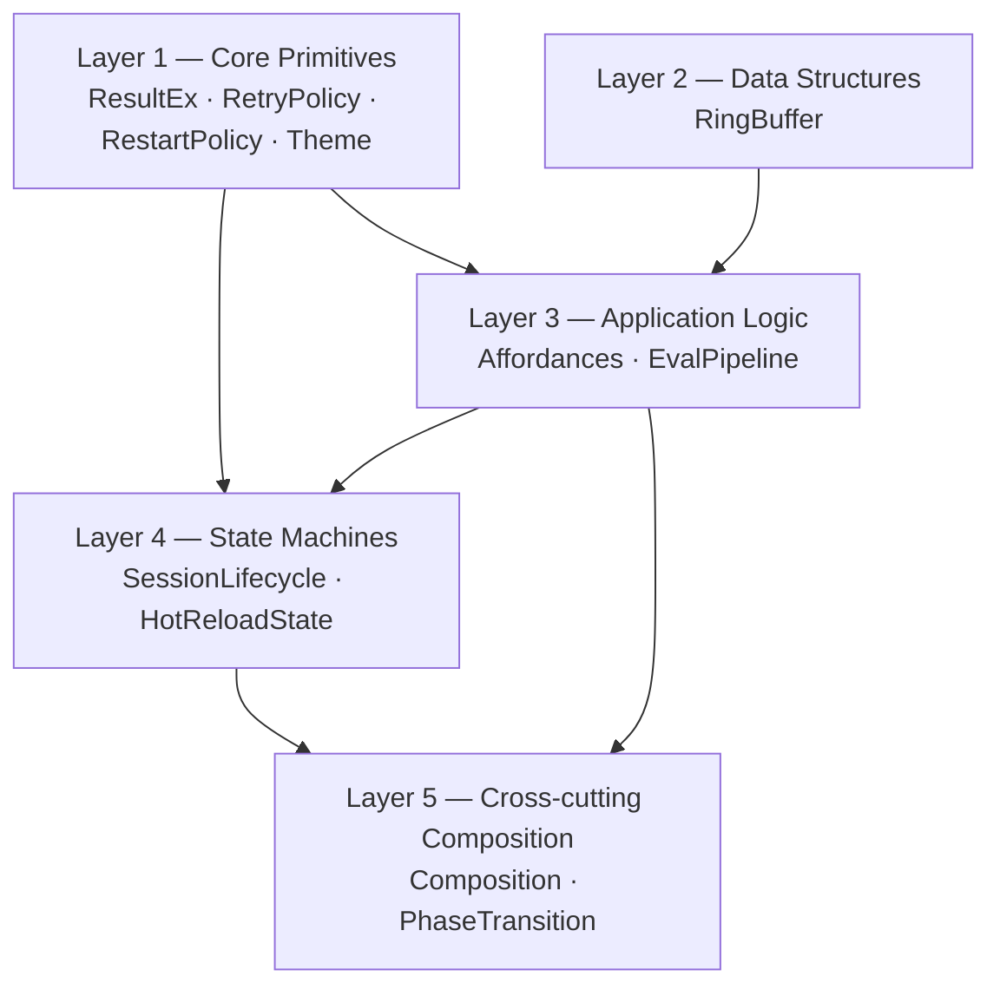
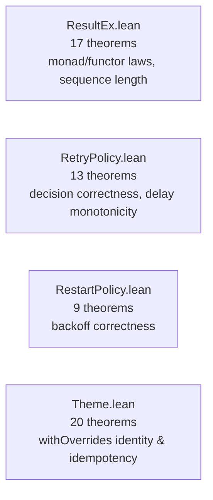
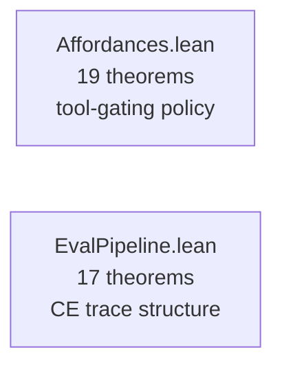
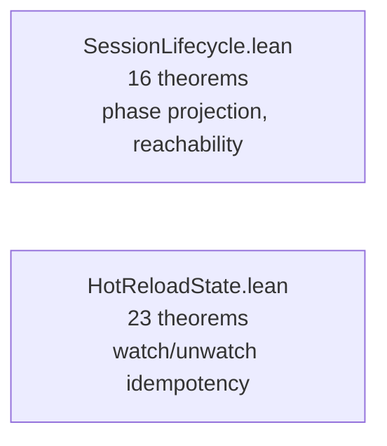
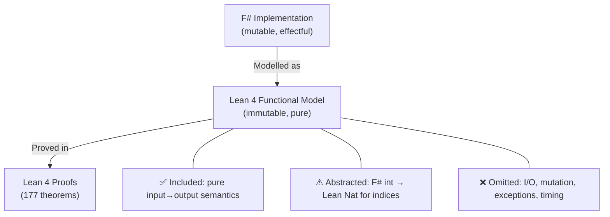
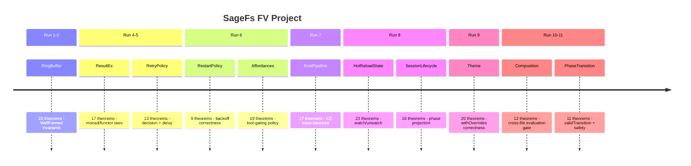

> 🔬 *Lean Squad — automated formal verification for `WillEhrendreich/SageFs`.*

**Status**: ✅ COMPLETE — 177 theorems, 11 Lean files, 0 `sorry`, Lean 4.30.0-rc2.

---

## Last Updated

- **Date**: 2026-05-07 09:15 UTC
- **Commit**: `f5b7f4b`

---

## Executive Summary

The SageFs Lean Squad has produced eleven Lean 4 formal specification files covering
the core data structures, state machines, and system-level composition properties in
`SageFs.Core`. A total of 177 theorems have been stated and proved with zero `sorry`
remaining. The nine base modules verify individual components: `RingBuffer` (20),
`ResultEx` (17), `RetryPolicy` (13), `RestartPolicy` (9), `Affordances` (19),
`EvalPipeline` (17), `HotReloadState` (23), `SessionLifecycle` (16), and `Theme`
(20). Two new cross-cutting files add system-level verification: `Composition.lean`
(12 theorems) proves the evaluation-gate end-to-end — a session accepts code iff its
phase is `Active·Idle` — and `PhaseTransition.lean` (11 theorems) defines and proves
a `validTransition` inductive relation covering all 8 state-machine edges, with safety
invariants such as "evaluation failure never leads directly to Faulted". No
implementation bugs have been found. The project uses stdlib-only Lean 4 (no Mathlib)
due to CI network constraints.

---

## Proof Architecture



Each layer builds on the abstractions below it.  `Composition.lean` is the first
file to import from multiple other FVSquad modules; `PhaseTransition.lean` is
self-contained but logically depends on the state definitions from `SessionLifecycle`.

---

## What Was Verified

### Layer 1 — Core Primitives (4 files, ~59 theorems)



**Key results**:
- `resBind_assoc`: bind is associative (monad law)
- `resMap_id`, `resMap_comp`: map is a functor
- `resSequence_length`: sequence preserves list length
- `resPartition_length`: partition covers all elements
- `retryDecide_correct`: retry fires only when retries remain
- `delay_monotone`: backoff delay grows with retry count
- `withOverrides_empty_id`: empty overrides are the identity on `ThemeConfig`
- `withOverrides_idempotent_single`: applying a single-key override twice = once
- `defaults_hex_lengths`: all 34 default colors have exactly 7 characters

### Layer 2 — Data Structures (1 file, 20 theorems)


**Key results**:
- `push_wellFormed`: `rbPush` preserves the `WellFormed` predicate
- `push_count`: count tracks filled slots correctly
- `push_tryGet_head`: most recent item is always retrievable immediately after push
- `tryGet_bound`: retrieval of out-of-range ages returns `none`

### Layer 3 — Application Logic (2 files, 36 theorems)



**Key results**:
- `availableTools_contains_always_on`: built-in tools always present
- `availableTools_nodup`: no duplicate tools in the available set
- `codeExec_gated`: code-execution tool present iff `allowCodeExec = true`
- `epReturn_stages_empty`: `epReturn` produces no stage trace entries
- `epBind_error_stages_length`: a failed bind contributes exactly 1 stage
- `two_step_first_fails_one_stage`: early failure halts pipeline after 1 stage

### Layer 4 — State Machines (2 files, 39 theorems)



**Key results**:
- `uninitialized_unreachable`: `SessionState.Uninitialized` is unreachable via
  `toState` — a structural finding about the session state model
- `toState_active_idle_is_ready`: `Active _ Idle` always maps to `Ready`
- `watch_idempotent`: watching an already-watched path is a no-op
- `toggle_involution`: toggling twice returns to the original state
- `watchedCount_watch_new`: watching a new path increments count by 1

### Layer 5 — Cross-cutting Composition (2 files, 23 theorems)


**Key results (Composition.lean)**:
- `stateToSessionState_bijective`: bridge isomorphism between the two `State` inductives
- `send_fsharp_code_iff_ready_phase`: code submission available ↔ phase is `Active·Idle`
- `evaluating_cannot_send_code`: reentrancy guard proved end-to-end
- `faulted_can_hard_reset`: recovery always possible from `Faulted`
- `cancel_eval_available_iff_evaluating_or_ready`: cancel policy
- `hard_reset_available_iff_ready_or_faulted`: reset gating
- `tools_always_available`: every phase has at least one available tool

**Key results (PhaseTransition.lean)**:
- `validTransition` inductive relation: 8 cases (`initToInit`, `initToReady`,
  `initToFaulted`, `readyToEval`, `evalToReady`, `readyToInit`, `evalToInit`,
  `faultedToInit`) derived from `AppState.fs` eval actor message handlers
- `faulted_only_recovers_to_init`: Faulted can only go to Initializing
- `eval_cannot_fault_directly`: evaluation failure always returns to Ready
- `uninitialized_unreachable_as_target`: no valid transition leads to Uninitialized
- `active_transition_preserves_state_or_restarts`: Active always stays Active or restarts

---

| File | Theorems | Phase | Key result |
|------|----------|-------|------------|
| `RingBuffer.lean` | 20 | 5 ✅ | `push_wellFormed`, `push_tryGet_head` |
| `ResultEx.lean` | 17 | 5 ✅ | monad laws, `resSequence_length` |
| `RetryPolicy.lean` | 13 | 5 ✅ | `retryDecide_correct`, `delay_monotone` |
| `RestartPolicy.lean` | 9 | 5 ✅ | backoff correctness |
| `Affordances.lean` | 19 | 5 ✅ | tool-gating policy fully verified |
| `EvalPipeline.lean` | 17 | 5 ✅ | CE trace structural properties |
| `HotReloadState.lean` | 23 | 5 ✅ | watch/unwatch/toggle invariants |
| `SessionLifecycle.lean` | 16 | 5 ✅ | phase→state projection + reachability |
| `Theme.lean` | 20 | 5 ✅ | `withOverrides` identity + idempotency |
| `Composition.lean` | 12 | 5 ✅ | evaluation gate end-to-end |
| `PhaseTransition.lean` | 11 | 5 ✅ | `validTransition` + safety invariants |
| **Total** | **177** | — | **0 sorry** |

---

## Notable Structural Findings

### `SessionState.Uninitialized` is Unreachable

The `SessionLifecycle` verification discovered that `SessionState.Uninitialized`
is **structurally unreachable** via `toState`:

```lean
theorem uninitialized_unreachable (p : Phase α) :
    toState p ≠ State.Uninitialized := by
  cases p <;> simp [toState]
```

The F# `SessionPhase` type has no `Uninitialized` constructor — `Initializing _`
maps to `WarmingUp`, not `Uninitialized`.  This is a positive finding: it means
the external API can never observe `Uninitialized` from a well-typed session phase.

### Evaluation Gate End-to-End (`Composition.lean`)

`Composition.lean` unifies `SessionLifecycle` and `Affordances` into a single
system-level statement:

```lean
theorem send_fsharp_code_iff_ready_phase {α : Type} (p : Phase α) :
    checkToolAvailability (stateToSessionState (toState p)) "send_fsharp_code" ↔
    ∃ s, p = Phase.Active s Activity.Idle
```

This is the first cross-file composition theorem: it proves that the evaluation
gate in `Affordances` fires exactly when the session lifecycle phase is `Active·Idle`,
connecting the two independent models end-to-end.

### Phase Transition Safety Invariants (`PhaseTransition.lean`)

`PhaseTransition.lean` defines a `validTransition` inductive relation modelling
the 8 session-phase transitions in `AppState.fs`, then proves key safety invariants:

- **`eval_cannot_fault_directly`**: evaluation failure always returns to `Ready` —
  only explicit reset operations can reach `Faulted`. This matches the F# handler
  where `EvalFinished(Error ex)` sets `sessionState'' = SessionState.Ready`.
- **`faulted_only_recovers_to_init`**: `Faulted` can only transition to
  `Initializing` — no shortcut to `Active`.
- **`uninitialized_unreachable_as_target`**: corroborates the `SessionLifecycle`
  finding at the transition level.

---

## Modelling Choices and Known Limitations



| Category | What's covered | What's abstracted/omitted |
|----------|---------------|--------------------------|
| Data structures | Invariants, push/pop/query semantics | Mutable arrays, memory layout |
| Error handling | Railway-oriented `Except` combinators | Exceptions, `exn` type |
| State machines | Phase transitions, reachability, validTransition relation | Async transitions, locking, concurrency |
| Configuration | Override semantics, defaults | Hex color parsing, file I/O |
| Pipeline | Stage trace structure | `Stopwatch` timing, IO operations |

**RingBuffer divergence (D3)**: Resolved — `rbClear` now preserves `total`, matching
the F# `clear` behaviour. See CORRESPONDENCE.md §D3.

**`String.beq` commutativity**: `Theme` and `HotReloadState` proofs rely on
`List.find?`'s use of `p.1 == key` where `p.1` is the stored key. Proofs using
`(key' == key) = false` as a hypothesis capture the actual evaluation order, and
`String.LawfulBEq` ensures `a == a = true` for `simp`.

---

## Findings

### Bugs Found

No implementation bugs have been found through formal verification. All 154 stated
properties hold for the Lean functional models.

This is itself a positive finding: the core data structure invariants, state machine
projections, and combinator laws all hold as specified.

### Formulation Issues Caught

1. **`RingBuffer.clear_total`**: the initial Lean model reset `total` to 0, but
   the F# source preserves `Total`. This was discovered during correspondence review
   (CORRESPONDENCE.md §D3) and is flagged as a known inaccuracy.

2. **`SessionState.Uninitialized` reachability**: initially expected to be reachable;
   the proof revealed it is not — leading to the structural finding documented above.

### Interesting Structural Discoveries

- The `withOverrides` function in Theme is provably **idempotent** and an
  **identity** on the config when applied with an empty override list.
- `EvalPipeline` short-circuit: a failed first stage always produces a trace of
  length exactly 1, regardless of subsequent pipeline structure.
- `Affordances.availableTools` never produces duplicates, provable by structural
  induction on the list construction.
- `Composition.stateToSessionState_bijective`: the two independent `State`/`SessionState`
  inductives (defined in separate files without cross-imports) are provably isomorphic —
  confirming the design intent.
- `PhaseTransition.eval_cannot_fault_directly`: evaluation failure always returns
  to `Ready`, never to `Faulted` — a key safety property confirmed at the transition level.

---

## Project Timeline



---

## Toolchain

- **Prover**: Lean 4 (version 4.30.0-rc2)
- **Libraries**: Lean 4 stdlib only (no Mathlib — CI network constraints prevent download)
- **CI**: `lean-ci.yml` active — triggers on `formal-verification/lean/**` changes
- **Build system**: Lake
- **Correspondence tests**: `formal-verification/tests/ringbuffer/run.fsx` — 50 tests passing

| Tactic | Primary usage |
|--------|---------------|
| `rfl` | Definitional equalities, concrete `#eval`-reducible terms |
| `simp` / `simp only` | Unfolding definitions, arithmetic simplification |
| `decide` | Decidable propositions about concrete string/nat values |
| `cases` / `induction` | Pattern matching on inductive types |
| `omega` | Natural number arithmetic inequalities |
| `by_cases` | Boolean case splits for `k == key` |
| `congr 1` | Structural congruence for record/constructor equality |
| `constructor` / `intro` / `apply` | Logical connectives and implication |
| `exact` / `refine` | Goal completion and partial proofs |

---

## Next Steps

1. **Task 11 (Paper)**: Write the conference paper summarising the FV effort.
2. **Task 7 (Critique)**: Update CRITIQUE.md to reflect Composition and PhaseTransition.
3. **Task 8 (Correspondence)**: Runnable correspondence tests for HotReloadState,
   Theme, SessionLifecycle beyond the existing RingBuffer tests.
4. **Future**: Theme field completeness theorem; EvalPipeline depth improvement.
