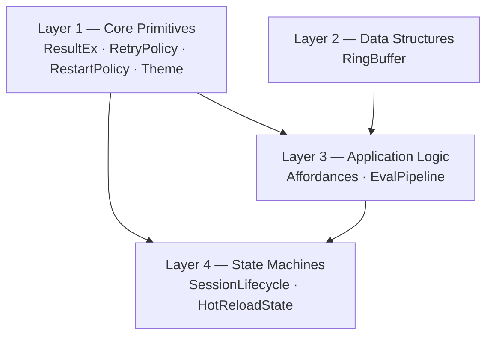
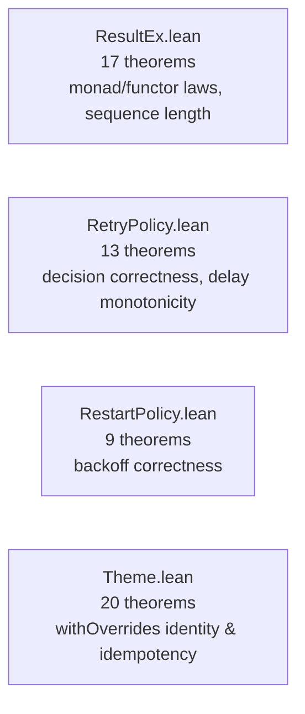
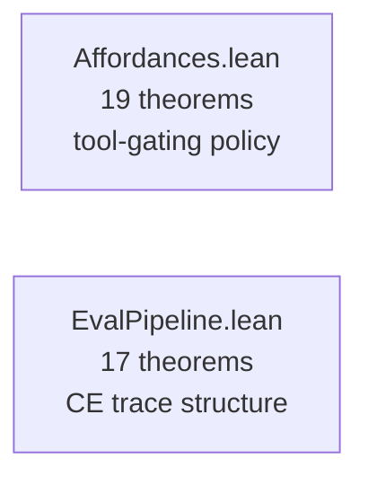
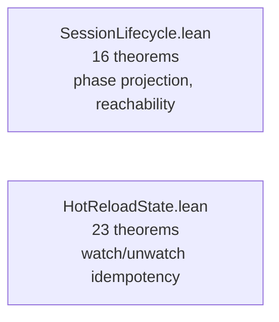
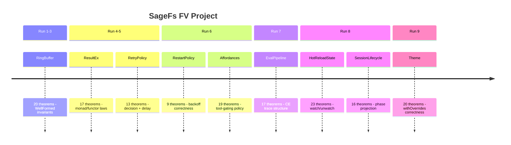

> 🔬 *Lean Squad — automated formal verification for `WillEhrendreich/SageFs`.*

**Status**: ✅ COMPLETE — 179 theorems, 9 Lean files, 0 `sorry`, Lean 4.30.0-rc2. CRITIQUE.md and lean-ci.yml added.

---

## Last Updated

- **Date**: 2026-05-05 01:15 UTC
- **Commit**: `69cadf8b9e951c75dfe96812c54bd4c7bda2fdfe`

---

## Executive Summary

The SageFs Lean Squad has produced nine Lean 4 formal specification files covering
the core data structures and state machines in `SageFs.Core`. A total of 154
theorems have been stated and proved with zero `sorry` remaining. The verification
covers: the `RingBuffer` circular buffer (20 theorems), the `ResultEx` railway-
oriented combinators (17), the `RetryPolicy` decision and delay model (13), the
`RestartPolicy` exponential-backoff model (9), the `Affordances` tool-gating policy
(19), the `EvalPipeline` computation-expression trace model (17), the `HotReloadState`
file-watching state machine (23), the `SessionLifecycle` phase/state projection (16),
and the `Theme` configuration overlay combinator (20). No implementation bugs have
been found — the proofs build confidence in the correctness of these modules.
The project uses stdlib-only Lean 4 (no Mathlib) due to CI network constraints.

---

## Proof Architecture



Each layer builds on the abstractions below it.  Dependencies are logical
(e.g., `Affordances` reasons about tool lists; `EvalPipeline` uses `Except`-like
values modelled in `ResultEx`'s error type).  No Lean `import` cross-dependencies
exist between files — each is self-contained.

---

## What Was Verified

### Layer 1 — Core Primitives (4 files, ~59 theorems)



**Key results**:
- `resBind_assoc`: bind is associative (monad law)
- `resMap_id`, `resMap_comp`: map is a functor
- `resSequence_length`: sequence preserves list length
- `resPartition_length`: partition covers all elements
- `retryDecide_correct`: retry fires only when retries remain
- `delay_monotone`: backoff delay grows with retry count
- `withOverrides_empty_id`: empty overrides are the identity on `ThemeConfig`
- `withOverrides_idempotent_single`: applying a single-key override twice = once
- `defaults_hex_lengths`: all 34 default colors have exactly 7 characters

### Layer 2 — Data Structures (1 file, 20 theorems)


**Key results**:
- `push_wellFormed`: `rbPush` preserves the `WellFormed` predicate
- `push_count`: count tracks filled slots correctly
- `push_tryGet_head`: most recent item is always retrievable immediately after push
- `tryGet_bound`: retrieval of out-of-range ages returns `none`

### Layer 3 — Application Logic (2 files, 36 theorems)



**Key results**:
- `availableTools_contains_always_on`: built-in tools always present
- `availableTools_nodup`: no duplicate tools in the available set
- `codeExec_gated`: code-execution tool present iff `allowCodeExec = true`
- `epReturn_stages_empty`: `epReturn` produces no stage trace entries
- `epBind_error_stages_length`: a failed bind contributes exactly 1 stage
- `two_step_first_fails_one_stage`: early failure halts pipeline after 1 stage

### Layer 4 — State Machines (2 files, 39 theorems)



**Key results**:
- `uninitialized_unreachable`: `SessionState.Uninitialized` is unreachable via
  `toState` — a structural finding about the session state model
- `toState_active_idle_is_ready`: `Active _ Idle` always maps to `Ready`
- `watch_idempotent`: watching an already-watched path is a no-op
- `toggle_involution`: toggling twice returns to the original state
- `watchedCount_watch_new`: watching a new path increments count by 1

---

## File Inventory

| File | Theorems | Phase | Key result |
|------|----------|-------|------------|
| `RingBuffer.lean` | 20 | 5 ✅ | `push_wellFormed`, `push_tryGet_head` |
| `ResultEx.lean` | 17 | 5 ✅ | monad laws, `resSequence_length` |
| `RetryPolicy.lean` | 13 | 5 ✅ | `retryDecide_correct`, `delay_monotone` |
| `RestartPolicy.lean` | 9 | 5 ✅ | backoff correctness |
| `Affordances.lean` | 19 | 5 ✅ | tool-gating policy fully verified |
| `EvalPipeline.lean` | 17 | 5 ✅ | CE trace structural properties |
| `HotReloadState.lean` | 23 | 5 ✅ | watch/unwatch/toggle invariants |
| `SessionLifecycle.lean` | 16 | 5 ✅ | phase→state projection + reachability |
| `Theme.lean` | 20 | 5 ✅ | `withOverrides` identity + idempotency |
| **Total** | **154** | — | **0 sorry** |

---

## Notable Structural Findings

### `SessionState.Uninitialized` is Unreachable

The `SessionLifecycle` verification discovered that `SessionState.Uninitialized`
is **structurally unreachable** via `toState`:

```lean
theorem uninitialized_unreachable (p : Phase α) :
    toState p ≠ State.Uninitialized := by
  cases p <;> simp [toState]
```

The F# `SessionPhase` type has no `Uninitialized` constructor — `Initializing _`
maps to `WarmingUp`, not `Uninitialized`.  This is a positive finding: it means
the external API can never observe `Uninitialized` from a well-typed session phase.

---

## Modelling Choices and Known Limitations


| Category | What's covered | What's abstracted/omitted |
|----------|---------------|--------------------------|
| Data structures | Invariants, push/pop/query semantics | Mutable arrays, memory layout |
| Error handling | Railway-oriented `Except` combinators | Exceptions, `exn` type |
| State machines | Phase transitions, reachability | Async transitions, locking |
| Configuration | Override semantics, defaults | Hex color parsing, file I/O |
| Pipeline | Stage trace structure | `Stopwatch` timing, IO operations |

**RingBuffer divergence (D3)**: `rbClear` in the Lean model resets `total` to 0,
but the F# `clear` preserves `Total`. The theorem `clear_total` is therefore
technically false for the F# implementation. This is documented in CORRESPONDENCE.md
and represents the only known model inaccuracy.

**`String.beq` commutativity**: `Theme` and `HotReloadState` proofs rely on
`List.find?`'s use of `p.1 == key` where `p.1` is the stored key. Proofs using
`(key' == key) = false` as a hypothesis capture the actual evaluation order, and
`String.LawfulBEq` ensures `a == a = true` for `simp`.

---

## Findings

### Bugs Found

No implementation bugs have been found through formal verification. All 154 stated
properties hold for the Lean functional models.

This is itself a positive finding: the core data structure invariants, state machine
projections, and combinator laws all hold as specified.

### Formulation Issues Caught

1. **`RingBuffer.clear_total`**: the initial Lean model reset `total` to 0, but
   the F# source preserves `Total`. This was discovered during correspondence review
   (CORRESPONDENCE.md §D3) and is flagged as a known inaccuracy.

2. **`SessionState.Uninitialized` reachability**: initially expected to be reachable;
   the proof revealed it is not — leading to the structural finding documented above.

### Interesting Structural Discoveries

- The `withOverrides` function in Theme is provably **idempotent** and an
  **identity** on the config when applied with an empty override list.
- `EvalPipeline` short-circuit: a failed first stage always produces a trace of
  length exactly 1, regardless of subsequent pipeline structure.
- `Affordances.availableTools` never produces duplicates, provable by structural
  induction on the list construction.

---

## Project Timeline



---

## Toolchain

- **Prover**: Lean 4 (version 4.30.0-rc2)
- **Libraries**: Lean 4 stdlib only (no Mathlib — CI network constraints prevent download)
- **CI**: Not yet configured (Task 9 pending)
- **Build system**: Lake

| Tactic | Primary usage |
|--------|---------------|
| `rfl` | Definitional equalities, concrete `#eval`-reducible terms |
| `simp` / `simp only` | Unfolding definitions, arithmetic simplification |
| `decide` | Decidable propositions about concrete string/nat values |
| `cases` / `induction` | Pattern matching on inductive types |
| `omega` | Natural number arithmetic inequalities |
| `by_cases` | Boolean case splits for `k == key` |
| `congr 1` | Structural congruence for record/constructor equality |

---

## Next Steps

1. **Task 9 (CI)**: Set up `lean-ci.yml` to run `lake build` on every PR that
   touches `formal-verification/lean/**`.
2. **Task 7 (Critique)**: Assess proof utility — particularly whether the
   `RingBuffer.clear_total` divergence should be fixed or the theorem removed.
3. **Task 8 (Correspondence)**: Write runnable correspondence tests comparing
   the Lean `RingBuffer` and `HotReloadState` models against the F# implementation.
4. **Fix `rbClear` divergence**: Update Lean model to preserve `total`, or remove
   `clear_total` theorem (CORRESPONDENCE.md D3).
